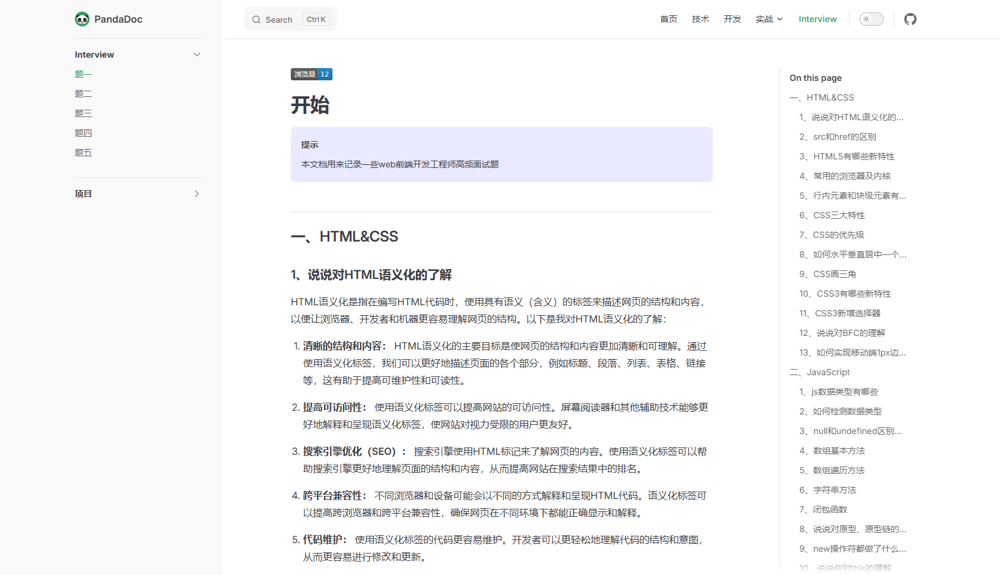

# pandaDoc

#### 介绍

欢迎来到 [PandaDoc](https://ihong-he.github.io/panda-doc/) —专为前端开发者打造的知识宝库与成长平台！无论你是编程世界的新手小白，还是寻求突破的进阶开发者，这里都是你理想的学习与交流空间。

- 访问地址：https://ihong-he.github.io/panda-doc/
- 首页
  

- 前端笔记
  

- 项目实战
  

- 面试模块
  

#### 软件架构

项目基于[VitePress](https://vitepress.dev/zh/)，VitePress 获取用 Markdown 编写的内容，对其应用主题，并生成可以轻松部署到任何地方的静态 HTML 页面。并且项目使用了 vue3 和[elementPlus](https://element-plus.org/zh-CN/)，可以更好的自定义页面内容。

#### 安装教程

> 提前安装运行环境 [nodejs](https://nodejs.org/en)，版本号`>=18`

1. 安装

   ```bash
   # or pnpm or yarn
   npm install
   ```

2. 运行

   ```bash
   npm run dev
   ```

3. 打包

   ```bash
   npm run build
   ```
> [!WARNING]
> 如果需要部署到服务器上，务必修改`config.js`文件中的`base`相对路径地址

4. 自动化部署

> 支持 github 自动化部署,参照 [GitHub Pages 部署指南](https://vitepress.dev/zh/guide/deploy#github-pages)

```bash
# 构建工作
build:
  runs-on: ubuntu-latest
  steps:
    - name: Checkout
      uses: actions/checkout@v4
      with:
        fetch-depth: 0 # 如果未启用 lastUpdated，则不需要
    # - uses: pnpm/action-setup@v3 # 如果使用 pnpm，请取消注释
    # - uses: oven-sh/setup-bun@v1 # 如果使用 Bun，请取消注释
    - name: Setup Node
      uses: actions/setup-node@v4
      with:
        node-version: 20
        cache: npm # 或 pnpm / yarn
    - name: Setup Pages
      uses: actions/configure-pages@v4
    - name: Install dependencies
      run: npm ci # 或 pnpm install / yarn install / bun install
    - name: Build with VitePress
      run: npm run docs:build # 或 pnpm docs:build / yarn docs:build / bun run docs:build
    - name: Upload artifact
      uses: actions/upload-pages-artifact@v3
      with:
        path: docs/.vitepress/dist # 修改为自己的路径
```

#### 使用说明

1.  `config` 文件配置项目，参照 [vitepress 配置](https://vitepress.dev/zh/reference/site-config)
2.  在 `theme` 文件夹自定义主题
3.  `public` 文件夹存放静态资源
4.  `.github/workflows` 文件配置 github 自动化部署

#### 参与贡献

1.  Fork 本仓库
2.  新建 Feat_xxx 分支
3.  提交代码
4.  新建 Pull Request
