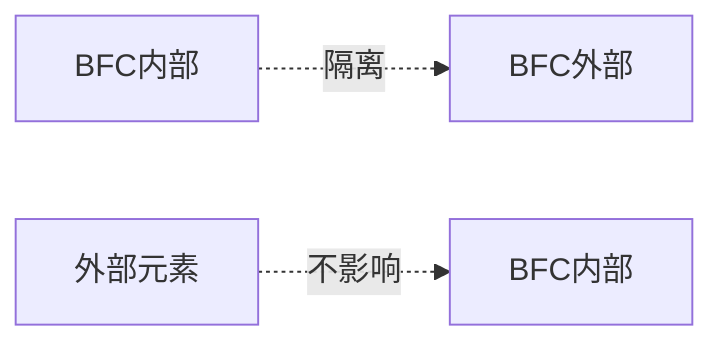

# HTML & CSS

::: tip 💡 面试小贴士
本章节涵盖HTML/CSS核心概念、布局技巧、性能优化等面试必备知识点，助你轻松应对前端技术面试！
:::


## 📑 目录表
[[toc]]

## 一、HTML基础

### 1、DOCTYPE是什么？为什么必须要有？

> 💡 **简单来说**，DOCTYPE是告诉浏览器是哪个版本的HTML来写这个网页的声明。它必须放在HTML文档的最顶部，在`<html>`标签之前。

**🎯 核心作用**：
- 告诉浏览器用哪种标准来解析和渲染页面
- 避免浏览器进入"怪异模式"，保证页面在不同浏览器中显示一致
- HTML5的DOCTYPE非常简单：`<!DOCTYPE html>`

::: warning ⚠️ 面试要点
没有DOCTYPE，浏览器可能用老版本的标准解析页面，导致样式错乱、布局问题，这是前端开发的基础常识。
:::

### 2、什么是HTML语义化？为什么重要？

> 📝 **定义**：语义化就是根据内容的含义选择合适的HTML标签，而不是只考虑外观效果。

**🔍 举个例子**：
- 用`<header>`、`<footer>`、`<nav>`等标签来表示页面的不同部分
- 用`<strong>`表示重要内容，用`<em>`表示强调，而不是直接用`<b>`、`<i>`

**🏢 为什么企业这么重视语义化**：
1. **🔍 SEO友好**：搜索引擎更容易理解页面结构，提升排名
2. **♿ 有利于无障碍访问**：屏幕阅读器能更好地为视障用户朗读内容
3. **🛠️ 代码维护性高**：团队协作时别人一看就懂每个区域的用途
4. **🎨 样式与结构分离**：便于后期重构和样式调整

::: tip 💼 面试回答技巧
强调语义化是现代Web开发的基础，体现了开发者的专业素养。
:::

### 3、浏览器渲染页面的过程是什么？

::: danger 🔥 高频考点
这是一个高频面试题，考察对浏览器工作原理的理解。
:::

**🔄 简单来说的渲染流程**：

1. **解析HTML** → 构建DOM树
2. **解析CSS** → 构建CSSOM树
3. **合并DOM和CSSOM** → 生成渲染树
4. **布局Layout** → 计算每个节点的几何信息
5. **绘制Paint** → 填充像素，将元素的视觉样式（颜色、边框、阴影等）绘制到位图中
6. **合成Composite** → 将各个绘制好的图层按照正确的顺序合成到最终的屏幕画面上

**⚡ 关键优化点**：
- CSS阻塞渲染，JS会阻塞HTML解析
- 重排和重绘会影响性能
- 理解这个过程有助于写出性能更好的代码

### 4、行内元素 vs 块级元素，怎么转换？

| 类型 | 📱 行内元素（inline） | 📦 块级元素（block） |
|------|----------------------|-------------------|
| **布局特性** | 不会单独占一行，和其他元素排在一行 | 独占一行，默认占满父容器宽度 |
| **尺寸设置** | 不能设置width、height，margin上下无效 | 可以设置width、height、margin等 |
| **常见标签** | `<span>`、`<a>`、``、`<strong>` | `<div>`、`<p>`、`<h1>-<h6>`、`<ul>`、`<li>` |

**🔄 转换方式**：
```css
/* 块级转行内 */
div { display: inline; }

/* 行内转块级 */
span { display: block; }

/* 两全其美：行内块 */
span { display: inline-block; }
```

> 💡 **补充**：现在还有`flex`、`grid`等显示模式，Flexbox和Grid布局在现代开发中更常用。

### 5、HTML5有哪些重要的新特性？

::: tip ✨ 革命性变化
HTML5带来了革命性变化，这些是面试官最喜欢问的：
:::

**🏷️ 新的语义化标签**：
- 结构标签：`<header>`、`<footer>`、`<nav>`、`<main>`、`<article>`、`<section>`、`<aside>`
- 让代码更有意义，利于SEO和无障碍访问

**🎬 多媒体支持**：
- `<audio>`、`<video>`标签，告别Flash时代
- 原生支持音频视频播放

**📝 表单增强**：
- 新的input类型：`email`、`date`、`number`、`tel`等
- 新属性：`placeholder`、`required`、`pattern`（正则表达式验证）等
- 内置验证功能，减少JavaScript代码

**🎨 图形和存储**：
- `<canvas>`：绘图API，可以画图、做游戏
- `localStorage`、`sessionStorage`：客户端存储
- 离线应用支持

**🚀 新API**：
- 地理定位、拖拽、WebSocket等

::: tip 💬 面试重点
HTML5让Web应用变得更强大，减少了对第三方插件的依赖。
:::

### 6、存储方案对比：Cookie vs LocalStorage vs SessionStorage

> 📊 **重要对比表格**，面试时直接说：

| 特性 | 🍪 Cookie | 💾 LocalStorage | 📋 SessionStorage |
|------|----------|----------------|------------------|
| **大小限制** | 4KB左右 | 5-10MB | 5-10MB |
| **生命周期** | 可设置过期时间 | 永久保存（除非手动清除） | 仅当前标签页有效 |
| **作用域** | 同域名下所有窗口 | 同源下所有页面 | 仅当前标签页 |
| **HTTP请求** | 每次都会自动携带 | 不会 | 不会 |
| **安全性** | 相对较低，易被劫持 | 较安全 | 较安全 |

**🎯 实际应用场景**：
- **🍪 Cookie**：用户登录状态、购物车信息、个性化设置
- **💾 LocalStorage**：用户偏好设置、离线数据缓存
- **📋 SessionStorage**：表单数据临时保存、页面间数据传递

::: info 💡 面试回答技巧
现在更推荐使用LocalStorage/SessionStorage，除非必须与服务器交互才用Cookie。
:::

## 二、CSS核心知识

### 1、CSS选择器优先级

::: warning 📚 必背知识点
CSS选择器优先级，这个必须背下来！
:::

**🔥 优先级从高到低**：
1. `!important`（慎用，会让维护变得困难）
2. **内联样式** `style="color: red"`
3. **ID选择器** `#header`
4. **类选择器/属性选择器/伪类** `.class`、`[type="text"]`、`:hover`
5. **元素选择器/伪元素** `div`、`::before`
6. **通配选择器** `*`

**🧠 简单记忆法**：
- 内联 > ID > 类/属性 > 标签 > 通配
- 相同优先级时，后面的覆盖前面的
- 可以用计算器类比：内联(1000) + ID(100) + 类(10) + 标签(1)

**❓ 面试常见问题**：
```css
/* 优先级：0,0,2,0（两个类选择器） */
.nav .item { color: blue; }

/* 优先级：0,1,0,0（一个ID选择器） */  
#nav { color: red; } /* 🔴 红色会胜出 */
```

### 2、哪些CSS属性可以继承？

**✅ 可继承的主要属性**（记住这些常用的）：

**🔤 字体相关**：
- `font-family`、`font-size`、`font-weight`、`font-style`
- `color`、`line-height`、`letter-spacing`、`text-align`

**🔧 其他**：
- `visibility`、`cursor`、`list-style`

**❌ 不可继承的常见属性**：
- 📦 盒模型相关：`width`、`height`、`margin`、`padding`、`border`
- 🎨 背景相关：`background`、`background-color`
- 📍 定位相关：`position`、`top`、`left`、`right`、`bottom`
- 👁️ 显示相关：`display`、`overflow`

::: tip 💡 面试技巧
可以强制继承用`inherit`值，但要注意性能影响。
:::

### 3、盒模型是什么？box-sizing怎么用？

> 📦 **盒模型就是网页元素的"包装盒"**，每个元素都是一个矩形盒子，从外到内包含：

**外边距（Margin）** → **边框（Border）** → **内边距（Padding）** → **内容区（Content）**

1. **📝 内容区（Content）**：实际内容所在
2. **📏 内边距（Padding）**：内容到边框的距离
3. **🖼️ 边框（Border）**：元素的边框线
4. **↔️ 外边距（Margin）**：元素与其他元素的距离

**⚖️ 两种盒模型标准**：

**🔷 标准盒模型（content-box，默认）**：
- `width`和`height`只包含内容区域
- 总宽度 = width + padding + border + margin

**🔶 IE盒模型（border-box）**：
- `width`和`height`包含内容、内边距和边框
- 总宽度 = width + margin

**💡 实际开发建议**：
```css
/* 现代开发推荐使用border-box */
*, *::before, *::after {
    box-sizing: border-box;
}
```

> ✅ **为什么推荐border-box**：计算更直观，不会因为加了padding和border而意外撑大容器。

### 4、CSS3有哪些新特性

::: danger 🔥 高频考点
CSS3带来了革命性变化，按类别记忆更清晰!
:::

**🎭 选择器增强**：
- **属性选择器** `[type="text"]`、`a[href^="https"]` - 根据属性值选择
- **结构伪类** `:first-child`、`:nth-child(2n)` - 按位置选择元素
- **状态伪类** `:hover`、`:focus`、`:checked`、`:disabled` - 交互状态

**📱 布局增强**：
- **Flexbox弹性布局** - 一维布局，主轴/交叉轴对齐，`justify-content`/`align-items`
- **Grid网格布局** - 二维布局，行列控制，`grid-template-columns`/`grid-template-areas`

**🎨 视觉特效类**：
- **圆角边框** `border-radius` - 告别图片切角，支持圆形
- **盒阴影** `box-shadow` - 卡片阴影效果，参数:水平/垂直偏移 模糊半径 颜色
- **渐变** `linear-gradient`/`radial-gradient` - 背景渐变，不再依赖图片

**🔄 变换与过渡类**：
- **2D/3D变换** `transform` - 旋转/缩放/平移/倾斜，用transform做动画性能更好
- **过渡** `transition` - 属性平滑过渡，语法:`property duration timing-function`
- **关键帧动画** `@keyframes` - 复杂动画序列，支持多阶段状态

**🌈 其他实用特性**：
- **媒体查询** `@media` - 响应式设计基础
- **滤镜** `filter` - 模糊/灰度/亮度调整
- **RGBA/HSLA颜色** - 支持透明度
- **视口单位** `vw`/`vh` - 相对视口尺寸


::: tip 💡 面试回答技巧
按类别回答：选择器增强 + 布局(flex/grid) + 视觉特效(圆角/阴影/渐变) + 动画过渡(transform/transition/@keyframes)，这样层次清晰，容易记忆。
:::


### 5、px、em、rem有什么区别？怎么选？

| 单位 | 📏 px（像素） | 📐 em | 🌍 rem（root em） |
|------|-------------|-------|------------------|
| **类型** | 绝对单位，固定大小 | 相对单位，相对于父元素的字体大小 | 相对单位，相对于根元素`<html>`的字体大小 |
| **计算方式** | 固定值 | 2em = 父元素字体大小的2倍 | 1rem = html字体大小（通常设置为16px） |
| **优点** | 精确，兼容性好 | 可以整体缩放 | 全局统一，方便整体缩放 |
| **缺点** | 不利于响应式设计和用户缩放 | 嵌套时容易混乱，1.5em的1.5em不是简单乘法 | 需要计算 |

**💻 现代开发最佳实践**：
```css
/* 设置基础字体大小 */
html {
    font-size: 16px;
}

/* 响应式调整 */
@media (max-width: 768px) {
    html { font-size: 14px; }
}

/* 使用rem单位 */
.container {
    width: 20rem;  /* 320px */
    margin: 1rem;  /* 16px */
}

/* 边框、阴影等固定尺寸用px */
.button {
    border: 1px solid #ddd;
    box-shadow: 0 2px 4px rgba(0,0,0,0.1);
}
```

**面试回答技巧**：推荐使用rem配合媒体查询做响应式，px用于固定尺寸，em慎用。

### 6、元素水平垂直居中的N种方法

::: danger 🎯 面试必考题
这是面试必考题，建议掌握前3种：
:::

**1. 🌟 Flexbox方法（最推荐）**：
```css
.parent {
    display: flex;
    justify-content: center;  /* 水平居中 */
    align-items: center;      /* 垂直居中 */
}
```

**2. 🎯 Grid方法（简单优雅）**：
```css
.parent {
    display: grid;
    place-items: center;  /* 一行搞定 */
}
```

**3. 📍 绝对定位 + transform（兼容性好）**：
```css
.parent {
    position: relative;
}
.child {
    position: absolute;
    top: 50%;
    left: 50%;
    transform: translate(-50%, -50%);
}
```

**📋 其他方法了解即可**：
- 绝对定位 + margin（需要知道子元素尺寸）
- 表格布局（老方法，不推荐）
- line-height（仅适用于单行文本）

::: tip 💡 面试选择策略
优先说Flexbox，次选Grid，最后提transform作为兼容方案。
:::

### 7、BFC到底是什么？什么时候用？

> 🌍  **BFC（Block Formatting Context，块级格式化上下文）** 是Web页面中一个独立的渲染区域，拥有独立的布局规则：



- BFC内部元素的布局不会影响外部
- 外部元素也不会影响BFC内部
- 就像一个隔离的布局环境

**⚙️ 如何创建BFC**：
- `overflow: hidden/auto`（最常用）
- `display: flex/grid`
- `position: absolute/fixed`
- `float: left/right`

**🔧 BFC能解决什么问题**：

1. **🌊 清除浮动**：父容器加`overflow: hidden`
2. **📏 防止margin重叠**：相邻元素用一个包起来
3. **📱 两栏自适应布局**：左边浮动，右边触发BFC

::: tip 💡 面试回答技巧
BFC主要用于解决布局问题，现在有了Flexbox和Grid，BFC用的相对少了，但理解它对调试布局bug很有帮助。
:::

### 8、移动端1px边框问题怎么解决？

> ❓ **问题原因**：现在的手机屏幕像素密度很高（比如Retina屏），CSS的1px在手机上实际占用了好几个物理像素，所以看起来会变粗。

**🛠️ 常见解决方案**：

**1. 🎯 使用transform缩放（推荐）**：

核心思路：通过伪元素创建边框，用`transform: scaleY(0.5)`将边框缩小一半。

```css
.border-1px {
    position: relative;
}
.border-1px::after {
    content: '';
    position: absolute;
    left: 0;
    bottom: 0;
    width: 100%;
    height: 1px;
    background: #ddd;
    transform: scaleY(0.5); /* 在2倍屏上将1px缩小为0.5px，实际渲染为1物理像素 */
    transform-origin: 0 0;
}
```

**2. 📱 使用viewport + rem**：

- 设置`viewport`的`initial-scale`为0.5，将页面整体缩小一半
- 所有尺寸按2倍设计稿开发，用rem单位适配不同屏幕
::: code-group
```html [HTML]
<!-- HTML中设置viewport -->
<meta name="viewport" content="width=device-width, initial-scale=0.5, 
    maximum-scale=0.5, user-scalable=no">
```
```javascript [JS]
// JS中动态设置rem基准值（以375px设计稿为例）
document.documentElement.style.fontSize = window.innerWidth / 750 + 'px';
// 使用时：1px = 0.01rem
```
:::

::: tip 💬 面试回答重点
说明问题产生的原因，提出1-2种具体解决方案。
:::

### 9、重绘和重排的区别？

| 类型 | 🔄 重排（Reflow/回流） | 🎨 重绘（Repaint） |
|------|---------------------|-------------------|
| **触发条件** | 元素的尺寸、位置发生改变 | 元素的外观发生改变，但位置不变 |
| **具体例子** | 修改width、height、margin、display等 | 修改color、background、visibility等 |
| **影响范围** | 重新计算整个页面的布局 | 只需要重新绘制受影响的区域 |
| **性能消耗** | 消耗很大，要尽量避免 | 消耗相对较小 |


### 10、响应式设计实战技巧

**媒体查询基础**：
```css
/* 移动端优先 */
body { font-size: 14px; }

/* 平板 */
@media (min-width: 768px) {
    body { font-size: 16px; }
}

/* 桌面端 */
@media (min-width: 1024px) {
    body { font-size: 18px; }
}
```

**响应式单位选择**：
- **rem**：字体、间距、padding等
- **vw/vh**：视口相关，如大图、全屏组件
- **%**：相对父元素，如容器宽度
- **px**：边框、阴影等固定元素

**移动端适配方案**：
```css
/* 1. 设置viewport */
<meta name="viewport" content="width=device-width, initial-scale=1.0">

/* 2. 使用rem + 媒体查询 */
html {
    font-size: 16px;
}
@media (max-width: 375px) {
    html { font-size: 14px; }
}

/* 3. flexible.js方案（淘宝方案） */
(function flexible(window, document) {
    // 根据屏幕宽度设置根字体大小
})();
```

**面试回答技巧**：重点说rem方案和媒体查询。

## 三、实战面试题

### 1、如何实现一个三栏布局？

::: danger 🎯 必考题目
面试时至少要会2种方法
:::

**1. 🌟 Flexbox方案（最推荐）**：

使用 `display: flex` 创建弹性布局，左右两侧固定宽度，中间部分通过 `flex: 1` 自动占据剩余空间。
```css
.container {
    display: flex;
}
.left, .right {
    width: 200px;
    flex-shrink: 0; /* 禁止收缩，保持固定宽度 */
}
.main {
    flex: 1; /* 自动占据剩余空间 */
}
```

**2. 🎯 Grid方案**：

使用 `display: grid` 创建网格布局，通过 `grid-template-columns: 200px 1fr 200px` 定义三列，其中 `1fr`单位让中间列自动填充剩余空间。
```css
.container {
    display: grid;
    grid-template-columns: 200px 1fr 200px;
}
```

**3. 🏛️ 圣杯布局（经典面试题）**：
- 左右栏浮动，中间栏margin
- 利用负margin和relative定位


### 2、暗黑模式实现方案

**🌙 CSS变量 + 媒体查询**：
```css
:root {
    --bg-color: #fff;
    --text-color: #333;
}

/* 检测系统是否处于深色模式（dark mode），如果是则应用以下样式 */
@media (prefers-color-scheme: dark) {
    :root {
        --bg-color: #1a1a1a;
        --text-color: #fff;
    }
}

body {
    background: var(--bg-color);
    color: var(--text-color);
    transition: background 0.3s, color 0.3s;
}
```


::: tip 🎉 总结
HTML&CSS面试的核心是基础扎实 + 实战经验 + 性能意识。重点掌握布局、性能优化、现代CSS特性，就能从容应对大部分面试！
:::