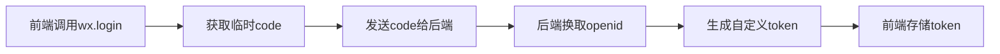
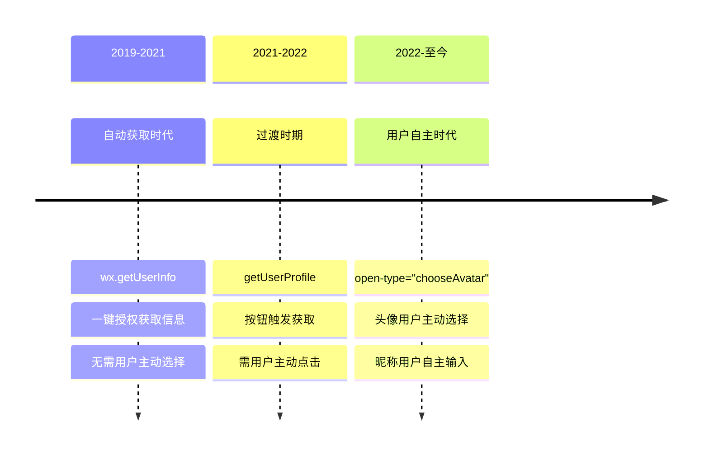
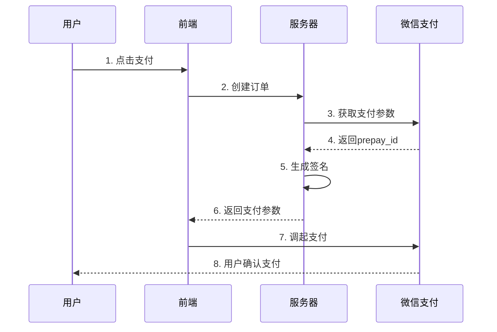

# 📱 小程序 & 📊 可视化大屏

::: tip 📚 面试小贴士
本文档覆盖微信小程序和可视化大屏开发的核心知识点，帮你快速掌握企业面试重点！小程序部分包含2025年最新写法变化，大屏部分聚焦实战经验和性能优化。
:::

## 📑 目录表
[[toc]]

## 📱 一、小程序

### 1、小程序有哪些文件类型，各自干啥的？

::: tip 📋 文件类型速记
微信小程序开发时会接触到这几种文件，记住它们的作用很重要：
:::

**文件类型一览：**

| 文件 | 类型 | 作用 | 说明 |
|------|------|------|------|
| `.json` | <Badge type="tip" text="配置" /> | 定义全局/页面配置 | `app.json`全局配置，页面配置管单个页面 |
| `.wxml` | <Badge type="info" text="结构" /> | 页面结构层 | 类似HTML，支持数据绑定、条件判断 |
| `.wxss` | <Badge type="info" text="样式" /> | 页面样式层 | 相当于CSS，支持微信特有写法 |
| `.js` | <Badge type="warning" text="逻辑" /> | 业务逻辑层 | JavaScript代码，CommonJS规范 |
| `.wxs` | <Badge type="warning" text="脚本" /> | 辅助计算脚本 | 轻量级JS，独立运行，性能更好 |

> 💡 **记忆口诀**：配置→结构→样式→逻辑

### 2、小程序生命周期有哪些？什么时候触发？

::: tip ⏰ 生命周期理解
生命周期就像人的一生，不同阶段做不同事：
:::

**🔄 页面生命周期：**

| 阶段 | 方法 | 触发时机 | 执行次数 |
|------|------|----------|----------|
| 🐣 出生 | `onLoad()` | 页面加载时 | **仅一次** |
| 🎓 成年 | `onReady()` | 页面渲染完成 | **仅一次** |
| 💼 上班 | `onShow()` | 页面显示时 | **每次显示** |
| 🏠 下班 | `onHide()` | 页面隐藏时 | **每次隐藏** |
| 👋 退休 | `onUnload()` | 页面卸载时 | **仅一次** |

::: danger 🔥 面试高频考点
- `onLoad`只执行一次，适合做初始化
- `onShow`每次都执行，适合做页面刷新
- 跳转方式会影响生命周期：`navigateTo`会触发`onHide`，`redirectTo`会触发`onUnload`
:::

### 3、最常用的组件和API有哪些？

::: danger 📚 必考知识点
这五大组件和五大API是面试常问的核心内容，必须熟练掌握！
:::

**🎨 五大组件（面试常问）：**

<div class="grid">

```html
<!-- 1. 万能容器 -->
<view>相当于div，布局用的</view>

<!-- 2. 文本显示 -->
<text>显示文字，比直接写字更规范</text>

<!-- 3. 按钮组件 -->
<button bindtap="handleClick">可以加各种事件</button>

<!-- 4. 图片组件 -->
<image src="/path/to/image" />支持网络和本地图片</image>

<!-- 5. 输入框 -->
<input placeholder="收集用户输入的" />
```

</div>

**⚡ 五大API（必须掌握）：**

| API | 功能 | 使用场景 |
|-----|------|----------|
| `wx.navigateTo` | 页面跳转，保留当前页 | 导航跳转 |
| `wx.request` | 发HTTP请求 | 获取数据 |
| `wx.showToast` | 弹提示 | 用户反馈 |
| `wx.getStorageSync` | 本地存储 | 数据持久化 |
| `wx.getLocation` | 获取位置 | 定位功能 |

> 💡 **核心原则**：组件负责"显示"，API负责"功能"，搭配使用开发效率才高。

### 4、页面之间怎么传数据？三种方式

::: warning 🔗 数据传递
页面间数据传递是小程序开发的必备技能，掌握这三种方式就够了！
:::

**🌟 方式一：全局变量（简单粗暴）**


<Badge type="warning" text="适合：公共数据" />

```js
// app.js
App({
  globalData: {
    userInfo: null
  }
})

// 页面里用
const app = getApp()
app.globalData.userInfo = '用户信息'
```


**🚀 方式二：URL传参（最常用）**

<Badge type="tip" text="最适合：规范传参" />

```js
// 发送页
wx.navigateTo({
  url: '/pages/detail/detail?id=123&name=张三'
})

// 接收页
onLoad: function(options) {
  console.log(options.id, options.name)
}
```


**💾 方式三：本地缓存（数据持久化）**

<Badge type="info" text="最适合：长期保存" />

用`wx.setStorageSync`存，`wx.getStorageSync`取，关了小程序数据还在。


::: tip 💬 面试技巧
问哪种方式好？URL传参最规范，全局变量适合存公共数据，缓存适合需要长期保存的数据。
:::

### 5、小程序启动慢怎么优化？

::: danger ⚡ 性能优化
小程序启动速度直接影响用户体验，这是面试高频考点！
:::

**📦 包体积优化（立竿见影）：**

- 🔄 **分包加载** <Badge type="tip" text="首选" /> - 主包只放核心页面，其他功能分包
- 🖼️ **图片压缩** - 用tinypng压缩，支持webp就更好了
- 📝 **代码复用** - 组件化开发，减少重复代码

**🌐 请求优化（用户体验）：**

- ⚡ **关键数据优先** - onLoad时先请求核心数据，次要数据后请求
- 📦 **合并请求** - 一次请求多拿数据，减少请求次数
- 💾 **缓存策略** - 不常变的数据用CDN缓存
- 🚀 **预加载** - 提前加载可能用到的数据

**🎨 渲染优化（性能提升）：**

- 🖼️ **图片懒加载** - 滚动到可视区域再加载
- ⚙️ **setData优化** - 不要一次设置太多数据，分批处理
- 🌳 **减少节点** - DOM层级不要太深

::: tip 💡 记忆口诀
> 分包减体积、缓存提速度、懒加载省流量、setData要克制。
:::

### 6、小程序分包怎么用？

::: tip 📦 分包加载
分包就像把大房子分成几个小房间，按需进入，解决主包体积限制问题！
:::

**🤔 为什么要分包：**

- ⚠️ **主包/单个分包不能超过2M** <Badge type="danger" text="限制" />
- 📦 **整个小程序所有分包总大小不超过20M**（服务商代开发的小程序）或**30M**（企业/个人自己开发的小程序）
- 🚀 **提升首屏加载速度**

**⚙️ 怎么配置分包：**

```json
// app.json
{
  "subPackages": [
    {
      "root": "packageA",
      "pages": ["page1", "page2"],
      "name": "pack1"
    }
  ]
}
```

**📁 目录结构：**

```
├── app.js
├── pages/           // 主包页面
└── packageA/        // 分包目录
    ├── page1/
    └── page2/
```

**🔄 动态加载分包：**

<details>
<summary>查看加载代码</summary>

```js
wx.loadSubPackage({
  name: 'pack1',
  success(res) {
    // 分包加载成功
  }
})
```

</details>

**⚡ 分包预加载：**

<details>
<summary>查看预加载配置</summary>

```json
// app.json
{
  "preloadRule": {
    "pages/index/index": {
      "network": "wifi",
      "packages": ["pack1"]
    }
  }
}
```

</details>

::: warning ❓ 面试常问
- 分包和主包的区别？主包必须包含首页、tabBar页面
- 分包什么时候加载？用户访问分包页面时加载
- 如何优化分包体验？设置预加载规则
:::

### 7、小程序登录流程是怎样的？

<!--  -->

::: tip 🔐 登录流程
登录流程就像进门验证身份，必须严格按照步骤来：
:::

**🔑 登录五步走：**



**📋 详细步骤：**

1. 🔐 **获取临时凭证code** - 前端调用`wx.login()`拿到code，<Badge type="danger" text="只能用一次" />
2. 📡 **发送给服务器** - 通过`wx.request()`把code发给你的后端
3. 🔄 **换取用户标识** - 后端用code向微信服务器换取`openid`和`session_key`
4. 🎫 **生成自定义登录态** - 服务器生成`token`返回给小程序
5. 💾 **存储登录状态** - 小程序存储token，后续请求带上这个token

**⚠️ 关键点记住：**
- code是**一次性**的，用完就废
- openid是用户**唯一标识**，永久有效
- session_key是**解密密钥**，要保存在服务器
- 登录态管理用**token或session**

::: warning ❓ 面试常问
code过期了怎么办？重新调用`wx.login()`获取新code。
:::

### 8、怎么获取用户头像和昵称？（2025年最新）

::: warning ⚠️ 政策变化
微信政策一直在变，现在不能直接获取用户信息了，必须用户主动操作！
:::

**👤 头像获取（新版）：**

用户点击选择头像后，通过`bind:chooseavatar`事件获取头像临时路径。

```html
<button open-type="chooseAvatar" bind:chooseavatar="onChooseAvatar">
  <image src="{{avatarUrl}}"></image>
</button>
```

**✍️ 昵称获取（新版）：**


`input`设置type为`nickname`，用户输入时微信会提供昵称建议。

```html
<input type="nickname" placeholder="请输入昵称" />
```


**📜 政策演变历史：**



::: danger 🔑 记住这个变化
- ❌ 旧版：`wx.getUserInfo` → `getUserProfile` → 现在都不能用了
- ✅ 新版：必须**用户主动操作**，不能再自动获取
- 👤 头像要用户选择，昵称要用户输入
:::

::: tip 💬 面试加分项
说清楚这个演变过程，体现你对技术发展的关注。
:::

### 9、小程序支付怎么实现？

::: danger 💰 支付安全
支付功能涉及资金，要特别注意安全和流程，这是企业级开发的核心！
:::

**🔄 完整支付流程：**



**💻 核心代码实现：**

```js
wx.requestPayment({
  timeStamp: '时间戳',
  nonceStr: '随机字符串', 
  package: 'prepay_id=xxxxx',
  signType: 'MD5',
  paySign: '签名',
  success(res) {
    // 支付成功，更新订单状态
  },
  fail(res) {
    // 支付失败，处理错误
  }
})
```

**🔒 安全要点：**

- 🔐 **签名必须在服务器生成** <Badge type="danger" text="重要" /> - 前端不能有密钥
- ✅ **支付结果要验证** - 防止伪造
- ⚠️ **异常情况要处理** - 用户取消、网络超时等

::: tip 💬 面试重点
支付流程、签名生成、异常处理是必考内容！
:::

### 10、用户取消支付怎么办？

::: warning ⚠️ 异常处理
用户取消支付很常见，处理不好影响用户体验，这是面试必问的异常处理场景！
:::

**🔍 检测取消操作：**

```js
wx.requestPayment({
  // 支付参数...
  fail(res) {
    if (res.errMsg === "requestPayment:fail cancel") {
      // 用户主动取消
      wx.showToast({
        title: '支付已取消',
        icon: 'none'
      })
      // 提供重新支付选项
    }
  }
})
```

**🛠️ 需要处理的场景：**

| 场景 | 处理方式 | 重要性 |
|------|----------|--------|
| 📋 订单状态回滚 | 标记为未支付 | ⭐⭐⭐⭐ |
| 📦 库存恢复 | 恢复库存数量 | ⭐⭐⭐⭐ |
| 🎫 优惠券恢复 | 退回优惠券 | ⭐⭐⭐ |
| 🔄 重新支付 | 提供再次支付入口 | ⭐⭐⭐⭐ |
| 💬 友好提示 | 不让用户觉得出错 | ⭐⭐⭐ |

**✨ 最佳实践：**

- 🔍 **支付前先确认** - 显示订单信息，让用户核对
- ⚡ **支付后立即验证** - 调接口查支付状态
- ⏰ **超时处理** - 设置支付超时时间

> 💡 **核心理念**：用户体验第一，让用户感觉操作流畅、安全可靠。


### 11、怎么跳转到其他小程序？

::: tip 🔗 跨小程序跳转
小程序之间跳转用开放能力，实现生态联动！
:::

**🚀 小程序内部跳转：navigateToMiniProgram**

```js
wx.navigateToMiniProgram({
  appId: '目标小程序appId',
  path: 'pages/index/index?id=123',
  extraData: {
    key: 'value' // 传给目标小程序的数据
  },
  success(res) {
    // 跳转成功
  }
})
```

**🎯 应用场景：**

- 🛒 **电商小程序跳转支付小程序**
- 🔧 **工具小程序跳转主应用**
- 🌟 **多小程序生态联动**


**🌐 外部链接跳转：URL Scheme (/skiːm/)**

生成格式：`weixin://dl/business/?t=miniProgram&appId=xxx&path=xxx`

**📱 适用场景：**
- 📧 **短信链接** - 最常用的场景
- 💬 **微信聊天** - 直接点击跳转  
- 🌐 **H5页面** - 从网页跳转小程序
- 📧 **邮件营销** - 邮件中的跳转链接


**🔙 返回处理：**


```js
// 目标小程序中处理返回
wx.navigateBackMiniProgram({
  extraData: {
    result: 'success'
  }
})
```
### 12、谈谈你对uni-app的理解？

::: tip 🚀 uni-app 简介
uni-app 是 DCloud 推出的**跨端开发框架**，用一套 Vue 代码可以同时开发微信小程序、H5、App（iOS/Android）、支付宝/百度/字节跳动小程序等，实现"一次编写，多端运行"。
:::

**🎯 核心优势：**

| 优势 | 说明 | 价值 |
|------|------|------|
| 📝 **一套代码** | Vue 语法 + 条件编译 | 大幅降低开发成本 |
| 📱 **多端覆盖** | 支持 10+ 平台 | 一套业务逻辑全端复用 |
| 🧩 **丰富生态** | uni-ui 组件库 + 插件市场 | 开箱即用，开发效率高 |
| ⚡ **性能优秀** | 原生渲染 + 优化编译 | 接近原生体验 |

**🏗️ 技术架构：**

- **开发层**：开发者编写 Vue 代码，使用 uni-app API
- **编译层**：uni-app 编译器 + 条件编译 + 运行时框架
- **运行层**：微信小程序 / H5 / App / 支付宝小程序...

**💻 代码示例：**

```vue
<template>
  <view class="container">
    <text>{{ title }}</text>
    <!-- 条件编译：仅微信小程序显示 -->
    #ifdef MP-WEIXIN
    <button open-type="share">分享</button>
    #endif
  </view>
</template>

<script>
export default {
  data() {
    return {
      title: 'Hello uni-app'
    }
  },
  onLoad() {
    // 统一 API 调用，自动适配各端
    uni.request({
      url: 'https://api.example.com/data',
      success: (res) => {
        console.log(res.data)
      }
    })
  }
}
</script>
```

**🔥 适用场景：**

| 场景 | 推荐理由 |
|------|----------|
| 🏢 **企业多端应用** | 需同时覆盖小程序+App+H5 |
| ⏰ **快速原型开发** | 时间紧、需求变动频繁 |
| 👥 **小团队项目** | 人员有限，减少重复开发 |

**⚠️ 注意事项：**

- 🚫 **不是所有功能都能跨端** - 平台特有功能需条件编译
- 🚫 **性能不如纯原生** - 超大型 App 建议原生或 Flutter
- 🚫 **坑比较多** - 各平台兼容性需要测试覆盖

> 💡 **面试加分项**：可以提到 uni-app 3.x 版本使用了 Vue3 + Vite，支持 Composition API，性能和开发体验都有大幅提升。

## 📊 二、可视化大屏

### 1、ECharts是什么？常用图表有哪些？

::: tip 📈 ECharts简介
ECharts是百度开源的JavaScript图表库，它能在网页上画各种漂亮的图表，而且功能很强大，配置也很灵活。
:::

**🎨 面试常问的图表类型：**

**📊 基础图表类：**

| 图表类型 | 适用场景 | 典型例子 |
|----------|----------|----------|
| 📈 **折线图（Line）** | 看趋势变化 | 用户增长、销售趋势 |
| 📊 **柱状图（Bar）** | 看数值对比 | 各城市销量、产品对比 |
| 🥧 **饼图（Pie）** | 看占比关系 | 市场份额、预算分配 |
| ⚡ **散点图（Scatter）** | 看变量关系 | 身高体重相关性 |

**🚀 高级图表类：**

| 图表类型 | 适用场景 | 特点 |
|----------|----------|------|
| 🎯 **雷达图** | 多维度数据对比 | 能力评估、产品对比 |
| 🔥 **热力图** | 数据密度和分布 | 地图人流密度 |
| 🌊 **桑基图** | 数据流向关系 | 资金流向、用户路径 |
| 📉 **漏斗图** | 转化率分析 | 用户转化流程 |

**🌟 3D图表类：**

- 🏗️ **3D柱状图** - 立体数据展示
- 🌍 **3D地球** - 地理数据可视化
- ⭐ **3D散点图** - 多维数据展示

::: tip 💬 面试技巧
背住这几类图表的应用场景，面试时能说清楚什么数据用什么图表展示，就很有竞争力了。
:::

### 2、大屏怎么适配不同屏幕？（面试高频题）

::: danger ⚠️ 核心难点
大屏适配是大屏开发的核心难点，面试必问！掌握这几种方案：
:::

**🔄 方案一：整体缩放（推荐，最常用）** <Badge type="tip" text="首选" />

核心思路：按设计稿比例整体缩放，简单粗暴但有效。

<details>
<summary>查看完整代码</summary>

```css
/* 基础样式 */
html, body {
    width: 100%;
    height: 100%;
    margin: 0;
    padding: 0;
    overflow: hidden; /* 防止滚动条 */
}

#screen {
    width: 1920px;  /* 设计稿宽度 */
    height: 1080px; /* 设计稿高度 */
    transform-origin: left top; /* 从左上角缩放 */
}

/* JavaScript动态缩放 */
function setScale() {
    const scale = Math.min(
        window.innerWidth / 1920,
        window.innerHeight / 1080
    );
    document.getElementById('screen').style.transform = `scale(${scale})`;
}

window.addEventListener('resize', setScale);
setScale();
```

</details>

**✅ 优点：** 实现简单，效果好，不会出现布局错乱

**❌ 缺点：** 可能会有黑边，分辨率不够时会模糊

---

**📱 方案二：REM适配（移动端常用）**

核心思路：动态设置根字体大小，所有尺寸用rem单位。

<details>
<summary>查看代码实现</summary>

```javascript
// 设计稿宽度为1920px，设置基础字体大小为100px
function setRem() {
    const baseWidth = 1920;
    const scale = document.documentElement.clientWidth / baseWidth;
    document.documentElement.style.fontSize = scale * 100 + 'px';
}

window.addEventListener('resize', setRem);
setRem();
```

**CSS中使用：**
```css
/* 192px / 100px = 1.92rem */
.chart-container {
    width: 1.92rem;
    height: 2rem;
}
```

</details>

---

**🎨 方案三：Flex布局 + 百分比（灵活适配）**

适合组件化程度高的大屏：

<details>
<summary>查看布局代码</summary>

```css
.screen-container {
    display: flex;
    width: 100%;
    height: 100%;
}

.left-panel {
    width: 20%;    /* 左侧占20% */
    height: 100%;
}

.center-panel {
    flex: 1;       /* 中间自适应 */
    height: 100%;
}

.right-panel {
    width: 25%;    /* 右侧占25% */
    height: 100%;
}
```

</details>

---

**🖥️ 方案四：媒体查询（多设备适配）**

针对不同分辨率制定不同样式：

<details>
<summary>查看媒体查询代码</summary>

```css
/* 超大屏 */
@media (min-width: 2560px) {
    .chart-title { font-size: 24px; }
}

/* 普通大屏 */
@media (min-width: 1920px) and (max-width: 2559px) {
    .chart-title { font-size: 18px; }
}

/* 小屏 */
@media (max-width: 1919px) {
    .chart-title { font-size: 14px; }
}
```

</details>

---

**📋 实际开发经验总结：**

| 场景 | 推荐方案 | 优势 |
|------|----------|------|
| 🖥️ PC大屏 | **缩放方案** | 开发简单，效果好 |
| 📱 移动端 | **REM方案** | 适配性好 |
| 🧩 组件化 | **Flex布局** | 提高复用性 |
| ⚙️ 细节调整 | **媒体查询** | 提升体验 |

> 💡 **别忘了响应式meta标签：**
> ```html
> <meta name="viewport" content="width=device-width, initial-scale=1.0">
> ```

::: tip 💬 面试回答模板
"我们项目用的是缩放适配方案，因为大屏主要是1920*1080分辨率，整体缩放能保证设计稿的完美还原。同时结合了Flex布局处理组件内部的响应式，还加了媒体查询做细节优化。"
:::

### 3、大屏数据更新怎么处理？（性能优化）

::: warning ⚡ 性能优化
数据更新是大屏性能的核心问题，处理不好会导致卡顿崩溃！
:::

**🚨 常见问题：**

- 🐌 **频繁更新导致页面卡顿**
- 📊 **大量数据渲染慢**
- 💾 **内存泄漏累积**

---

**🔄 解决方案：**

**1. 定时轮询 + 缓存**

<details>
<summary>查看代码实现</summary>

```javascript
// 智能轮询，有数据变化才更新
let lastData = {};

function fetchData() {
    fetch('/api/dashboard-data')
        .then(res => res.json())
        .then(data => {
            // 检查数据是否有变化
            if (JSON.stringify(data) !== JSON.stringify(lastData)) {
                updateCharts(data);
                lastData = data;
            }
        });
}

// 根据业务调整轮询间隔
setInterval(fetchData, 5000); // 5秒轮询一次
```

</details>

<Badge type="tip" text="智能缓存" />

---

**2. WebSocket实时推送**

<details>
<summary>查看代码实现</summary>

```javascript
const ws = new WebSocket('ws://your-domain.com/ws');

ws.onmessage = function(event) {
    const data = JSON.parse(event.data);
    // 批量更新，减少重绘次数
    batchUpdateCharts(data);
};

function batchUpdateCharts(data) {
    // 用requestAnimationFrame优化渲染
    requestAnimationFrame(() => {
        chart1.setOption(data.chart1);
        chart2.setOption(data.chart2);
        chart3.setOption(data.chart3);
    });
}
```

</details>

<Badge type="info" text="实时性更强" />

---

**3. 数据分页加载**

<details>
<summary>查看代码实现</summary>

```javascript
// 大数据量时用分页，避免一次性渲染过多数据
function loadChartData(page = 1, pageSize = 1000) {
    fetch(`/api/chart-data?page=${page}&size=${pageSize}`)
        .then(res => res.json())
        .then(data => {
            // 增量渲染
            appendChartData(data);
        });
}
```

</details>

<Badge type="warning" text="大数据必用" />

---

**4. 图表性能优化**

<details>
<summary>查看ECharts优化配置</summary>

```javascript
// ECharts性能优化配置
const option = {
    animation: false,        // 关闭动画提升性能
    hoverLayerThreshold: 3000, // 超过3000个数据点启用渐进渲染
    progressive: 1000,       // 渐进式渲染阈值
    progressiveThreshold: 5000, // 开启渐进渲染的阈值
    series: [{
        type: 'line',
        large: true,         // 开启大数据优化
        largeThreshold: 2000, // 大数据量阈值
        data: hugeDataArray
    }]
};
```

</details>

---

**🎯 面试加分项：**

- 🛡️ **防抖和节流技术**
- 🌀 **虚拟滚动概念**
- 🔧 **Chrome DevTools性能分析**


### 4、大屏项目遇到过什么坑？（实战经验）

::: danger 🚨 实战经验
这些是大屏开发中真实的坑，遇到能解决说明有实战经验！
:::

**1. 图表不显示/显示不完整**

<details>
<summary>查看解决方案</summary>

```javascript
// 确保容器有明确的宽高
.chart-container {
    width: 100%;
    height: 400px;
}

// 图表初始化时机要正确
onMounted(() => {
    nextTick(() => {
        chartInstance = echarts.init(domElement);
    });
});
```

</details>

<Badge type="warning" text="常见问题" />

---

**2. 浏览器标签页切换回来图表空白**

<details>
<summary>查看解决方案</summary>

```javascript
// 监听页面可见性变化
document.addEventListener('visibilitychange', function() {
    if (!document.hidden && chartInstance) {
        chartInstance.resize();
    }
});

// 或者监听窗口大小变化
window.addEventListener('resize', debounce(() => {
    chartInstance?.resize();
}, 300));
```

</details>

<Badge type="info" text="经典问题" />

---

**3. 内存泄漏导致越来越卡**

<details>
<summary>查看资源清理代码</summary>

```javascript
// 组件销毁时清理资源
onUnmounted(() => {
    if (chartInstance) {
        chartInstance.dispose(); // 销毁图表实例
        chartInstance = null;
    }
    // 清理定时器
    if (timer) {
        clearInterval(timer);
    }
    // 关闭WebSocket
    if (websocket) {
        websocket.close();
    }
});
```

</details>

<Badge type="danger" text="性能关键" />

---

**4. 数据量大时渲染慢**

<details>
<summary>查看性能优化方案</summary>

```javascript
// 数据采样，减少渲染点数
function sampleData(data, maxPoints = 1000) {
    if (data.length <= maxPoints) return data;
    const step = Math.ceil(data.length / maxPoints);
    return data.filter((_, index) => index % step === 0);
}

// 或者用ECharts的数据采样功能
option: {
    dataZoom: [{
        type: 'inside',
        start: 0,
        end: 100 // 只显示部分数据
    }]
}
```

</details>

<Badge type="tip" text="大数据必备" />

---

**5. 多图表联动处理**

<details>
<summary>查看联动实现</summary>

```javascript
// 图表联动
const chart1 = echarts.init(dom1);
const chart2 = echarts.init(dom2);

// 监听第一个图表的事件
chart1.on('click', function(params) {
    // 更新第二个图表
    chart2.setOption({
        series: [{
            data: getFilteredData(params.name)
        }]
    });
});

// 或者使用ECharts的联动API
echarts.connect([chart1, chart2]);
```

</details>

<Badge type="info" text="高级功能" />

---

::: tip 💬 面试经验分享
"我之前做大屏项目时遇到过图表切换标签页后不显示的问题，后来发现是resize没有正确触发。我加了visibilitychange监听和防抖处理，就解决了。还有就是内存泄漏问题，现在都会在组件销毁时主动dispose图表实例。"
:::

**🎯 面试要点：**
- 🧩 强调**组件化思维**
- 📱 提到**响应式处理**经验
- ⚡ 说明**性能优化**考虑
- 🔍 展示对**细节的关注**

> 💡 **核心理念**：大屏开发不只是技术，更是产品思维，要让数据展示既美观又实用！