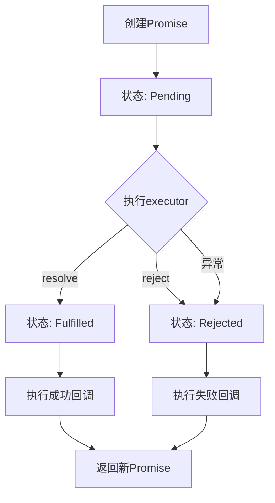

# 💻 笔试实战指南

::: tip 📚 面试小贴士
本文档涵盖JavaScript核心知识点和手写代码面试题，帮你快速掌握企业面试重点！重点理解原理，结合代码实例加深记忆。
:::

## 📑 目录表
[[toc]]
## 🚀 一、面试实战

### 1、前端性能优化

#### **🎯 核心思路**
减少请求、加快加载、优化渲染

#### **📦 资源加载优化**

| 优化点 | 具体措施 |
|--------|----------|
| **减少HTTP请求** | 合并CSS/JS文件、使用雪碧图/Icon字体 |
| **压缩资源** | Gzip压缩、代码压缩（Terser）、图片压缩（WebP） |
| **CDN加速** | 静态资源使用CDN分发 |
| **懒加载** | 图片懒加载（loading="lazy"）、路由懒加载 |

#### **⚡ 渲染性能优化**

- **减少DOM操作**：使用文档片段、虚拟列表
- **防抖节流**：滚动、resize事件使用防抖/节流
- **避免重排重绘**：批量修改样式、使用CSS transform

#### **🚀 Vue/React首屏优化**

```javascript
// Vue 路由懒加载
const Home = () => import('@/views/Home.vue')
const routes = [
  { path: '/', component: Home }
]

// React 路由懒加载
const Home = React.lazy(() => import('./Home'))
<Route path="/" element={<Home />} />
```

**首屏专项优化：**

| 优化方向 | 具体措施 | 效果 |
|----------|----------|------|
| **SSR服务端渲染** | Next.js/Nuxt.js，减少白屏时间 | ⭐⭐⭐⭐⭐ |
| **预加载关键资源** | `<link rel="preload">` 提前加载关键CSS/JS | ⭐⭐⭐⭐ |
| **骨架屏** | 数据加载前显示占位结构，提升体验 | ⭐⭐⭐⭐ |
| **代码分割** | 按路由/组件拆分，按需加载 | ⭐⭐⭐⭐⭐ |
| **服务端生成** | SSG静态生成，SSR动态渲染 | ⭐⭐⭐⭐ |

#### **🚀 SSR服务端渲染**
```javascript
// Next.js 示例
export async function getServerSideProps(context) {
  // 服务端获取数据
  const data = await fetchData();
  return {
    props: { data }  // 页面直接渲染完整内容
  };
}
```

## ✍️ 二、手写代码

### 1、数组去重

::: danger 🔥 面试必考
数组去重是JavaScript面试中的高频基础题，必须掌握多种实现方式！
:::

#### **✅ 方法 1：使用 Set（最推荐）**

```javascript
function uniqueArray(arr) {
    return [...new Set(arr)];
}

// 测试
console.log(uniqueArray([1, 2, 2, 3, 4, 4])); // [1, 2, 3, 4]
```

::: tip 💡 记忆口诀
**Set天生去重，扩展运算符转数组**
:::

---

#### **🔍 方法 2：使用 filter + indexOf**

```javascript
function uniqueArray(arr) {
    return arr.filter((item, index) => arr.indexOf(item) === index);
}
```

::: info 💡 原理说明
**过滤首次出现，相同项只留第一个**。indexOf只返回第一个匹配项的索引。
:::

---

#### **🔄 方法 3：传统 for 循环**

```javascript
function uniqueArray(arr) {
    const result = [];
    for (let i = 0; i < arr.length; i++) {
        if (!result.includes(arr[i])) {
            result.push(arr[i]);
        }
    }
    return result;
}
```

::: info 💡 原理说明
**遍历检查是否存在，不存在就push**。最基础的实现方式。
:::

---

#### **🚀 面试加分项：对象数组去重**

```javascript
function uniqueObjects(arr, key) {
    return [...new Map(arr.map(item => [item[key], item])).values()];
}

const users = [
    {id: 1, name: '张三'},
    {id: 2, name: '李四'},
    {id: 1, name: '张三重复'}
];

console.log(uniqueObjects(users, 'id'));
// [{id: 1, name: '张三'}, {id: 2, name: '李四'}]
```

::: tip 🎯 核心技巧
使用Map的键唯一性，将指定字段作为key，去重后提取value数组！
:::

### 2、冒泡排序

::: info 🫧 排序基础
冒泡排序是最基础的排序算法，理解其原理对掌握其他排序算法很有帮助！
:::

#### **🌊 核心原理**
冒泡排序就像气泡一样，**大的往上冒，小的往下沉**！

```javascript
function bubbleSort(arr) {
  const n = arr.length;
  for (let i = 0; i < n - 1; i++) {
    // 提前退出标志位，性能优化
    let swapped = false;
    for (let j = 0; j < n - 1 - i; j++) {
      if (arr[j] > arr[j + 1]) {
        // 交换相邻元素，ES6解构赋值最简洁
        [arr[j], arr[j + 1]] = [arr[j + 1], arr[j]];
        swapped = true;
      }
    }
    // 如果本轮没交换，说明已经排好了
    if (!swapped) break;
  }
  return arr;
}

// 测试
const array = [5, 2, 9, 1, 5, 6];
console.log('排序前：', array);
console.log('排序后：', bubbleSort(array));
```

#### **🧠 记忆口诀**

```
外层循环控制轮次，内层循环比较相邻
大的往后换，小的往前移
一轮下来最大值沉底
swapped标志优化，有序提前停
```

#### **⭐ 面试要点**

- ✅ **稳定性**：稳定的排序算法（相等元素顺序不变）
- 🎯 **适用场景**：数据量小，基本有序的情况
- 💡 **优化关键**：swapped标志位，避免无效轮次

::: warning ⚠️ 面试陷阱
一定要记得加上swapped标志位优化，这是面试加分项！
:::


### 3、快速排序

::: danger 🚀 高频考点
快速排序是面试中最常考的排序算法，必须掌握分治思想！
:::

#### **⚡ 核心思想**
**选个基准，左边小右边大，递归搞定！**

```javascript
function quickSort(arr) {
  // 递归出口：数组为空或只有一个元素，直接返回
  if (arr.length <= 1) {
    return arr;
  }

  // 选基准，选中间的
  const pivot = arr[Math.floor(arr.length / 2)];
  const left = [];   // 比基准小的
  const right = [];  // 比基准大的
  const equal = [];  // 和基准相等的

  // 分组
  for (const num of arr) {
    if (num < pivot) {
      left.push(num);
    } else if (num > pivot) {
      right.push(num);
    } else {
      equal.push(num);
    }
  }

  // 递归左右两边，然后合并
  return [...quickSort(left), ...equal, ...quickSort(right)];
}

// 测试
const array = [5, 2, 9, 1, 5, 6];
console.log('排序前：', array);
console.log('排序后：', quickSort(array));
```

#### **🎯 四步口诀**

1. **选基准（pivot）** - 找个数当裁判
2. **分三组** - 小的、大的、相等的  
3. **递归调用** - 左右两边继续排
4. **合并结果** - 左+中+右搞定

#### **⭐ 面试要点**

- ❌ **稳定性**：不稳定排序（相等元素可能改变顺序）
- 💾 **空间复杂度**：O(log n) - 递归栈空间
- 🚀 **原地排序版本**：面试加分手写题

::: tip 💡 基准选择技巧
- 随机选择：避免最坏情况
- 三数取中：首、中、末的中位数
- 实际应用：更多使用内置排序方法
:::

### 4、浅拷贝和深拷贝

::: warning 🎯 核心区别
一句话区分：**浅拷贝只复制表面，深拷贝复制到底！**
:::

#### **📋 对比表格**

| 特性 | 浅拷贝 | 深拷贝 |
|------|--------|--------|
| **复制深度** | 只复制一层属性 | 递归复制所有层级 |
| **引用类型** | 复制引用（共享内存） | 创建新对象（独立内存） |
| **修改影响** | 影响原对象 | 不影响原对象 |
| **性能开销** | 小 | 大 |
| **实现复杂度** | 简单 | 复杂 |

---

#### **🔍 浅拷贝 - 只复制一层**

```javascript
// 方法1：Object.assign()
const shallowCopy = (obj) => Object.assign({}, obj);

// 方法2：展开运算符（推荐）
const shallowCopy = (obj) => ({ ...obj });

// 示例
const obj = { a: 1, b: { c: 2 } };
const copy = shallowCopy(obj);
copy.b.c = 99;  // 修改copy，原对象也会变！
console.log(obj.b.c); // 99 - 这就是浅拷贝的问题
```

::: danger ⚠️ 浅拷贝陷阱
引用类型（对象、数组）仍然是共享的，修改会影响原对象！
:::

---

#### **💪 深拷贝 - 完全独立**

#### **方法1：JSON方法（最简单，有限制）**
```javascript
const deepCopy = (obj) => JSON.parse(JSON.stringify(obj));

// 局限：无法处理函数、Date、RegExp、undefined等
const obj = { 
  a: 1, 
  fn: () => {}, 
  date: new Date() 
};
const copy = deepCopy(obj); // fn和date会丢失或类型错误
```

| 支持类型 | 不支持类型 |
|----------|------------|
| ✅ 基本类型 | ❌ 函数 |
| ✅ 简单对象 | ❌ Date对象 |
| ✅ 数组 | ❌ RegExp对象 |
| ✅ null | ❌ undefined |
| | ❌ 循环引用 |

#### **方法2：递归实现（面试常考）**
```javascript
const deepCopy = (obj) => {
  // 基本类型和null直接返回
  if (obj === null || typeof obj !== 'object') return obj;
  
  // 处理Date对象
  if (obj instanceof Date) return new Date(obj);
  // 处理RegExp对象
  if (obj instanceof RegExp) return new RegExp(obj);
  
  // 创建新容器（数组或对象）
  const copy = Array.isArray(obj) ? [] : {};
  
  // 递归复制每个属性
  for (const key in obj) {
    if (obj.hasOwnProperty(key)) {
      copy[key] = deepCopy(obj[key]);
    }
  }
  return copy;
};
```

#### **方法3：structuredClone（现代浏览器首选）**
```javascript
const deepCopy = (obj) => structuredClone(obj);
// 支持大部分类型，包括循环引用！
```

#### **🎯 面试要点**

- 🧠 **理解原理**：浅拷贝复制引用，深拷贝复制值
- ✍️ **手写递归**：记住边界条件判断
- ⚡ **性能考虑**：深拷贝比浅拷贝开销大
- 🛠️ **选择标准**：根据实际需求选择合适方法

::: tip 💡 记忆技巧
**浅拷贝 = 复制地址，深拷贝 = 复制内容**
:::

### 5、数组扁平化

::: danger 🔥 面试高频
数组扁平化是JavaScript面试中的经典算法题，考察递归思维和数组操作能力！
:::

#### **🎯 核心概念**
数组扁平化就是把嵌套数组拍平成一维数组：
```
[1, [2, [3, 4], 5], 6] → [1, 2, 3, 4, 5, 6]
```

#### **📊 方法对比**

| 方法 | 实现难度 | 时间复杂度 | 可读性 | 推荐指数 |
|------|----------|------------|--------|----------|
| **递归实现** | 中等 | O(n) | 高 | ⭐⭐⭐⭐⭐ |
| **reduce递归** | 较难 | O(n) | 中 | ⭐⭐⭐⭐ |
| **ES6 flat()** | 简单 | O(n) | 极高 | ⭐⭐⭐⭐⭐ |
| **toString技巧** | 简单 | O(n) | 中 | ⭐⭐ |

---

#### **🔄 方法1：递归实现（最直观）**

```javascript
function flattenArray(arr) {
  let result = [];
  
  for (let i = 0; i < arr.length; i++) {
    if (Array.isArray(arr[i])) {
      // 是数组就递归，然后拼接结果
      result = result.concat(flattenArray(arr[i]));
    } else {
      // 不是数组就push
      result.push(arr[i]);
    }
  }
  return result;
}

// 测试
const nestedArray = [1, [2, [3, 4], 5], 6];
console.log(flattenArray(nestedArray)); // [1, 2, 3, 4, 5, 6]
```

::: tip 💡 核心思路
**是数组就继续递归，不是数组就收集结果**
:::

---

#### **⚡ 方法2：reduce + 递归（函数式风格）**

```javascript
const flatten = arr => 
  arr.reduce((acc, cur) => 
    Array.isArray(cur) ? acc.concat(flatten(cur)) : acc.concat(cur)
  , []);

// 测试
console.log(flatten([1, [2, [3, 4], 5], 6])); // [1, 2, 3, 4, 5, 6]
```

::: info 🎨 亮点
使用reduce展示函数式编程能力，代码更简洁！
:::

---

#### **🚀 方法3：ES6 flat()（生产环境首选）**

```javascript
// 指定深度，Infinity表示无限深度
const result = [1, [2, [3, 4], 5], 6].flat(Infinity);
console.log(result); // [1, 2, 3, 4, 5, 6]
```

| 参数 | 说明 |
|------|------|
| **flat(1)** | 扁平化一层 |
| **flat(2)** | 扁平化两层 |
| **flat(Infinity)** | 完全扁平化 |

---

#### **🎭 方法4：toString + split（巧解，有局限）**

```javascript
function flattenByString(arr) {
  return arr.toString().split(',').map(item => +item || item);
}

// 局限：只适用于纯数字数组
console.log(flattenByString([1, [2, [3, 4], 5], 6])); // [1, 2, 3, 4, 5, 6]
```

::: warning ⚠️ 使用限制
- 只适用于纯数字数组
- 会丢失数字类型信息（转为字符串再转回数字）
- 不适合包含字符串的数组
:::

#### **🎯 面试要点**

- 🧠 **递归思维**：必须掌握递归思路
- 🎨 **函数式编程**：reduce版本展示编程素养  
- 📚 **ES6特性**：了解flat()方法的使用
- 🔍 **边界情况**：空数组、非数组元素、循环引用

#### **💡 记忆口诀**

- **递归思想**：是数组就继续，不是就收集
- **reduce思路**：累积器+递归，简洁高效  
- **toString技巧**：转字符串再分割，偷懒解法

::: tip 🚀 推荐策略
面试用手写递归，生产环境用flat()！
:::

### 6、防抖和节流

::: danger 🔥 面试必考
防抖和节流是性能优化的核心手段，理解其区别和应用场景是面试必备技能！
:::

#### **🎯 核心概念对比**

| 特性 | 🛡️ 防抖 (Debounce) | ⏱️ 节流 (Throttle) |
|------|-------------------|-------------------|
| **执行时机** | 停止触发后延迟执行 | 固定时间间隔执行 |
| **触发次数** | 可能只执行1次 | 会执行多次 |
| **核心思想** | 延迟执行，重置计时 | 频率控制，定期执行 |
| **经典场景** | 搜索框、resize事件 | 滚动加载、按钮防连点 |
| **生活比喻** | 等你停手了再发送 | 水龙头滴水的频率 |

---

#### **🛡️ 防抖（Debounce）- 等你停手了再执行**

::: tip 💡 生活比喻
防抖就像打字时的延迟发送，你不停输入，就一直等，停了才发送。
:::

```javascript
function debounce(func, delay) {
  let timer;  // 延迟执行的定时器
  
  return function (...args) {
    // 每次触发都清除上一个定时器
    clearTimeout(timer);
    
    // 重新设置定时器
    timer = setTimeout(() => {
      func.apply(this, args);  // 保持this指向
    }, delay);
  };
}

// 使用场景：搜索框输入
const searchInput = document.getElementById('search');
searchInput.addEventListener('input', debounce((e) => {
  console.log('搜索：', e.target.value);
  // 发送API请求
}, 500));
```

**🎯 适用场景：**
- 🔍 **搜索框输入**：用户停止输入再发送请求
- 📱 **手机号验证**：输入完成后验证
- 🪟 **窗口resize**：用户调整完窗口大小再计算

---

#### **⏱️ 节流（Throttle）- 固定时间间隔执行**

::: tip 💡 生活比喻  
节流就像水龙头，不管你怎么拧，水滴都是固定频率流出来的。
:::

#### **方法1：定时器版本（推荐）**
```javascript
function throttle(func, delay) {
  let timer = null;
  
  return function (...args) {
    if (!timer) {
      timer = setTimeout(() => {
        func.apply(this, args);
        timer = null;  // 执行完后重置
      }, delay);
    }
  };
}
```

#### **方法2：时间戳版本**
```javascript
function throttleTimestamp(func, delay) {
  let lastTime = 0;
  
  return function (...args) {
    const now = Date.now();
    if (now - lastTime >= delay) {
      func.apply(this, args);
      lastTime = now;
    }
  };
}

// 使用场景：滚动事件
window.addEventListener('scroll', throttle(() => {
  console.log('滚动位置：', window.scrollY);
  // 更新进度条、懒加载等
}, 100));
```

**🎯 适用场景：**
- 📜 **页面滚动**：固定时间更新滚动位置
- 🖱️ **鼠标移动**：限制事件触发频率
- 🔘 **按钮防连点**：避免快速重复点击

---

#### **🔍 实现对比**

| 实现方式 | 优点 | 缺点 |
|----------|------|------|
| **定时器版** | 保证首次触发 | 可能有延迟 |
| **时间戳版** | 立即执行 | 最后一次可能不执行 |

---

#### **⭐ 面试要点**

- 🎯 **this指向**：都要正确处理this指向（使用apply/call）
- 🎨 **参数传递**：使用rest参数确保所有参数都能传递
- 📚 **场景区分**：理解各自的适用场景
- 🧠 **原理理解**：防抖是"延迟执行"，节流是"频率控制"

#### **💡 记忆口诀**

- **防抖**：等你停了再动 ⏳
- **节流**：定时来一次，不管你怎么折腾 ⏱️

::: tip 🚀 进阶技巧
面试时可以讨论**立即执行版防抖**和**节流防抖结合**的高级用法！
:::

### 7、JS对象转为树形结构

::: info 🌳 数据结构转换
扁平数组转树形结构是前端开发中的常见需求，特别适用于菜单、目录、组织架构等场景！
:::

#### **🎯 核心思路**

将扁平数据转换为树形结构的关键是：**建立父子关系映射**！

| 步骤 | 操作 | 目的 |
|------|------|------|
| **1** | 创建Map映射 | O(1)时间复杂度查找节点 |
| **2** | 遍历建立关系 | 将子节点挂载到父节点 |
| **3** | 提取根节点 | 获取最终的树形结构 |

```javascript
function buildTree(data) {
  const tree = [];
  const map = new Map();

  // 初始化哈希表，用 id 作为键
  data.forEach(item => {
    map.set(item.id, { ...item, children: [] });
  });

  // 构建树
  data.forEach(item => {
    const node = map.get(item.id);
    if (item.parentId === null) {
      // 顶级节点
      tree.push(node);
    } else {
      // 非顶级节点，加入父节点的 children
      const parent = map.get(item.parentId);
      if (parent) {
        parent.children.push(node);
      }
    }
  });

  return tree;
}
```

#### **📋 测试数据与结果**

```javascript
// 测试数据
const input = [
  { id: 1, name: '根节点', parentId: null },
  { id: 2, name: '子节点 1', parentId: 1 },
  { id: 3, name: '子节点 2', parentId: 1 },
  { id: 4, name: '子节点 1-1', parentId: 2 },
  { id: 5, name: '子节点 2-1', parentId: 3 },
];

const tree = buildTree(input);
console.log(JSON.stringify(tree, null, 2));
```

::: details 🌲 输出结果展示

```json
[
  {
    "id": 1,
    "name": "根节点",
    "parentId": null,
    "children": [
      {
        "id": 2,
        "name": "子节点 1",
        "parentId": 1,
        "children": [
          {
            "id": 4,
            "name": "子节点 1-1",
            "parentId": 2,
            "children": []
          }
        ]
      },
      {
        "id": 3,
        "name": "子节点 2",
        "parentId": 1,
        "children": [
          {
            "id": 5,
            "name": "子节点 2-1",
            "parentId": 3,
            "children": []
          }
        ]
      }
    ]
  }
]
```

:::

#### **📊 算法分析**

| 指标 | 复杂度 | 说明 |
|------|--------|------|
| **时间复杂度** | O(n) | 两次遍历，Map查找O(1) |
| **空间复杂度** | O(n) | Map存储和结果数组 |
| **稳定性** | 稳定 | 保持原始数据顺序 |

#### **⭐ 面试要点**

- 🧠 **Map的优势**：O(1)查找，比数组遍历更高效
- 🎯 **边界情况**：处理不存在的父节点、循环引用
- 🛠️ **实际应用**：菜单渲染、权限树、目录结构
- 🔄 **反向操作**：树形结构转扁平数组

#### **💡 应用场景**

| 场景 | 数据特点 | 应用举例 |
|------|----------|----------|
| **🗂️ 菜单系统** | 有层级关系 | 导航菜单、右键菜单 |
| **📁 文件系统** | 递归嵌套 | 资源管理器、目录树 |
| **🏢 组织架构** | 上下级关系 | 部门架构、员工层级 |
| **🔧 分类系统** | 多级分类 | 商品分类、标签体系 |

::: tip 🚀 进阶技巧
可以扩展支持**排序**、**过滤**、**搜索**等高级功能！
:::


### 8、提取 URL 参数

::: info 🔗 URL解析
提取URL参数是前端开发中的常见需求，处理路由、API请求等场景必备技能！
:::

#### **🎯 核心实现**

```javascript
function parseQueryParams(url) {
  const queryString = url.split('?')[1]; // 获取问号后面的部分
  if (!queryString) {
    return {}; // 如果没有查询参数，返回空对象
  }

  const params = {};
  const pairs = queryString.split('&'); // 根据 & 拆分每个键值对

  pairs.forEach(pair => {
    const [key, value] = pair.split('='); // 根据 = 拆分键和值
    params[decodeURIComponent(key)] = decodeURIComponent(value || ''); // 解码并处理空值
  });

  return params;
}

// 测试
const url = 'https://example.com/page?name=John&age=30&city=New%20York';
const result = parseQueryParams(url);
console.log(result);
```

#### **📋 解析结果**

```json
{
  "name": "John",
  "age": "30", 
  "city": "New York"
}
```

#### **🔍 解析步骤详解**

| 步骤 | 操作 | 示例 | 结果 |
|------|------|------|------|
| **1** | `split('?')` | `url.split('?')` | `['https://example.com/page', 'name=John&age=30&city=New%20York']` |
| **2** | `split('&')` | `'name=John&age=30'.split('&')` | `['name=John', 'age=30', 'city=New%20York']` |
| **3** | `split('=')` | `'name=John'.split('=')` | `['name', 'John']` |
| **4** | `decodeURIComponent()` | `'New%20York'` | `'New York'` |

#### **💡 关键要点**

- ✅ **URL解码**：必须使用`decodeURIComponent()`处理特殊字符
- 🛡️ **边界处理**：处理无参数、空值、未编码字符等情况  
- 🔧 **扩展功能**：可以支持数组参数、嵌套对象等复杂场景

#### **🚀 进阶版本**

::: details 点击查看增强版实现

```javascript
function parseQueryParamsAdvanced(url) {
  const queryString = url.split('?')[1];
  if (!queryString) return {};

  const params = {};
  const pairs = queryString.split('&');

  pairs.forEach(pair => {
    let [key, value] = pair.split('=');
    key = decodeURIComponent(key);
    value = value ? decodeURIComponent(value) : '';

    // 处理数组参数：key[]
    if (key.endsWith('[]')) {
      const arrayKey = key.slice(0, -2);
      if (!params[arrayKey]) params[arrayKey] = [];
      params[arrayKey].push(value);
    }
    // 处理嵌套对象：key[subKey]
    else if (key.includes('[')) {
      const [mainKey, subKey] = key.match(/([^[]+)\[(.+)\]/).slice(1);
      if (!params[mainKey]) params[mainKey] = {};
      params[mainKey][subKey] = value;
    }
    // 普通参数
    else {
      params[key] = value;
    }
  });

  return params;
}

// 测试复杂场景
const complexUrl = 'https://example.com?name=John&tags[]=tag1&tags[]=tag2&user[age]=25&user[city]=Beijing';
console.log(parseQueryParamsAdvanced(complexUrl));
```

:::

#### **⭐ 面试要点**

- 🧠 **核心原理**：字符串分割与URL解码
- 🛡️ **安全性**：防范XSS攻击，注意参数验证
- 📚 **现代API**：`URLSearchParams`、`new URL()`等浏览器原生API
- ⚡ **性能考虑**：大数据量时的处理策略

::: tip 🎯 实际应用
- 🛒 **电商网站**：商品筛选、分页参数
- 🔍 **搜索功能**：关键词、过滤条件
- 📊 **数据分析**：UTM参数、统计标识
:::

---

### 9、交换a,b的值

::: tip 🔄 变量交换
不使用临时变量交换两个值是面试中的基础算法题，考察对位运算和ES6特性的理解！
:::

#### **📊 方法对比**

| 方法 | 可读性 | 性能 | 安全性 | 推荐指数 |
|------|--------|------|--------|----------|
| **数组解构** | ⭐⭐⭐⭐⭐ | ⭐⭐⭐⭐ | ⭐⭐⭐⭐⭐ | ⭐⭐⭐⭐⭐ |
| **加减法** | ⭐⭐⭐ | ⭐⭐⭐⭐⭐ | ⭐⭐ | ⭐⭐⭐ |
| **异或运算** | ⭐⭐ | ⭐⭐⭐⭐⭐ | ⭐⭐⭐⭐ | ⭐⭐⭐ |

---

#### **✅ 方法1：数组解构（推荐）**

```javascript
let a = 5, b = 3;

[a, b] = [b, a]; // ES6解构赋值，一行搞定

console.log(a, b); // 输出：3, 5
```

::: tip 🌟 优势
- 代码简洁，可读性最好
- 支持所有数据类型
- 现代JavaScript首选方法
:::

---

#### **➕ 方法2：加减法**

```javascript
let a = 5, b = 3;

a = a + b; // a = 8 (5+3)
b = a - b; // b = 5 (8-3) 
a = a - b; // a = 3 (8-5)

console.log(a, b); // 输出：3, 5
```

::: warning ⚠️ 注意事项
- **数值溢出**：大数相加可能超出安全范围
- **类型限制**：只适用于数字类型
- **精度问题**：浮点数可能有精度损失
:::

---

#### **🔀 方法3：异或（XOR）运算**

```javascript
let a = 5, b = 3;

a = a ^ b; // a = 6 (0101 ^ 0011 = 0110)
b = a ^ b; // b = 5 (0110 ^ 0011 = 0101)  
a = a ^ b; // a = 3 (0110 ^ 0101 = 0011)

console.log(a, b); // 输出：3, 5
```

::: info 💡 异或原理
异或运算满足交换律和结合律：
- `a ^ a = 0`（相同为0）
- `a ^ 0 = a`（与0异或不变）
- `(a ^ b) ^ a = b`（可逆性）

**三步原理：**
1. `a = a ^ b` （存储异或结果）
2. `b = a ^ b` = `(a ^ b) ^ b` = `a` （还原a）
3. `a = a ^ b` = `(a ^ b) ^ a` = `b` （还原b）
:::

---

#### **🎯 面试要点**

| 考察点 | 重点说明 |
|--------|----------|
| **ES6特性** | 解构赋值的灵活应用 |
| **位运算** | 异或运算的理解和应用 |
| **边界情况** | 数值溢出、类型限制、精度问题 |
| **性能对比** | 不同方法的执行效率 |

#### **💡 选择建议**

| 场景 | 推荐方法 |
|------|----------|
| **日常开发** | 🌟 数组解构 |
| **算法竞赛** | ⚡ 加减法或异或 |
| **面试展示** | 🎚️ 全部掌握，对比分析 |

::: tip 🚀 进阶技巧
可以讨论**对象属性交换**、**数组元素交换**等扩展场景！
:::

### 10、1到100求和

::: info 🔢 数学基础
1到100求和看似简单，但能考察多种编程思想和算法复杂度分析能力！
:::

#### **📊 方法对比分析**

| 方法 | 时间复杂度 | 空间复杂度 | 可读性 | 面试亮点 |
|------|------------|------------|--------|----------|
| **循环求和** | O(n) | O(1) | ⭐⭐⭐⭐⭐ | 基础扎实 |
| **数学公式** | O(1) | O(1) | ⭐⭐⭐⭐⭐ | 数学思维 |
| **递归求和** | O(n) | O(n) | ⭐⭐⭐ | 递归理解 |
| **reduce函数** | O(n) | O(1) | ⭐⭐⭐⭐ | 函数式编程 |

---

#### **🔄 方法一：普通循环（最基础）**

```javascript
let sum = 0;
for (let i = 1; i <= 100; i++) {
  sum += i;
}
console.log("循环求和:", sum); // 5050
```

::: tip 💡 优点
- 思路清晰，易于理解
- 适用性广，可处理任意范围
- 内存占用低，空间复杂度O(1)
:::

---

#### **⚡ 方法二：数学公式（最优解）**

```javascript
// 高斯求和公式：(首项 + 末项) × 项数 ÷ 2
const sumFormula = (1 + 100) * 100 / 2;
console.log("公式求和:", sumFormula); // 5050
```

::: danger 🎯 面试重点
**时间复杂度O(1)**，这是最优解！必须记住高斯求和公式：
```
S = n(a₁ + aₙ) / 2
```
:::

#### **📐 公式推导**
```
1 + 2 + 3 + ... + 100
100 + 99 + 98 + ... + 1
------------------------
101 + 101 + 101 + ... + 101 (100个)
= 100 × 101 / 2 = 5050
```

---

#### **🔄 方法三：递归（展示递归思维）**

```javascript
function sumRecursive(n) {
  if (n === 1) return 1;  // 递归出口
  return n + sumRecursive(n - 1);  // 递归公式
}
console.log("递归求和:", sumRecursive(100)); // 5050
```

::: warning ⚠️ 注意事项
- **栈溢出风险**：大数字可能导致栈溢出
- **性能较差**：相比循环有额外的函数调用开销
- **面试价值**：展示递归思维能力

**递归分析：**
- 时间复杂度：O(n)
- 空间复杂度：O(n) - 递归栈
:::

---

#### **🎨 方法四：reduce（函数式编程）**

```javascript
const sumReduce = Array.from({length: 100}, (_, i) => i + 1)
  .reduce((acc, cur) => acc + cur, 0);
console.log("reduce求和:", sumReduce); // 5050
```

::: tip 🌟 亮点
- **函数式编程**：展示现代JavaScript编程风格
- **链式调用**：代码简洁优雅
- **扩展性强**：易于添加过滤、映射等操作

::: details 🔍 reduce方法详解

```javascript
// 创建数组：[1, 2, 3, ..., 100]
Array.from({length: 100}, (_, i) => i + 1)
  .reduce((accumulator, currentValue) => {
    return accumulator + currentValue;
  }, 0); // 初始值为0
```

- `accumulator`：累积器，上一次返回的值
- `currentValue`：当前处理的元素
- `0`：初始值
:::

---

#### **⭐ 面试要点**

| 考察维度 | 重点关注 |
|----------|----------|
| **算法思维** | 数学公式的理解和应用 |
| **复杂度分析** | 时间和空间复杂度的计算 |
| **编程范式** | 命令式vs函数式编程 |
| **边界处理** | 大数处理、异常情况 |

#### **🚀 扩展思考**

```javascript
// 通用求和函数
function rangeSum(start, end) {
  if (start > end) [start, end] = [end, start]; // 交换确保start <= end
  
  // 数学公式：等差数列求和
  return (end - start + 1) * (start + end) / 2;
}

console.log(rangeSum(1, 100));    // 5050
console.log(rangeSum(50, 150));   // 7625  
console.log(rangeSum(100, 1));    // 5050（自动处理）
```

::: tip 💡 记忆技巧
**面试时优先说数学公式，然后说其他方法展示编程多样性！**
:::

---

### 11、函数柯里化（面试高阶题）

::: danger 🎓 高阶函数
函数柯里化是JavaScript面试中的高阶题目，考察函数式编程思想和闭包理解！
:::

#### **🎯 核心概念**

柯里化就是把一个多参数函数，转换成一系列单参数函数的调用：

```javascript
// 原函数：add(1, 2, 3) → 6
// 柯里化后：curriedAdd(1)(2)(3) → 6
```

#### **📋 柯里化 vs 偏函数**

| 特性 | 柯里化 | 偏函数 |
|------|--------|--------|
| **参数处理** | 每次只接收一个参数 | 可以接收多个参数 |
| **调用方式** | `f(a)(b)(c)` | `f(a, b)(c)` |
| **返回值** | 总是返回函数 | 参数够了返回结果 |
| **复杂度** | 较高 | 较低 |

---

#### **🔧 基础柯里化实现**

```javascript
function curry(fn) {
  return function curried(...args) {
    if (args.length >= fn.length) {
      return fn.apply(this, args);
    } else {
      return function (...args2) {
        return curried.apply(this, args.concat(args2));
      };
    }
  };
}

// 使用示例
function add(a, b, c) {
  return a + b + c;
}

const curriedAdd = curry(add);
console.log(curriedAdd(1)(2)(3)); // 6
console.log(curriedAdd(1, 2)(3)); // 6
console.log(curriedAdd(1)(2, 3)); // 6
```

::: info 💡 核心原理
- **闭包机制**：保持对原函数和累积参数的引用
- **参数累积**：通过`args.concat(args2)`收集所有参数
- **递归调用**：直到参数数量满足要求才执行原函数
:::

---

#### **🎨 实用场景**

#### **场景1：创建专用函数**
```javascript
// 通用加法函数
const add10 = curriedAdd(10);
console.log(add10(5)(5)); // 20
console.log(add10(20));    // 30

// 乘法柯里化
const multiply = curry((a, b) => a * b);
const double = multiply(2);  // 乘以2的专用函数
console.log(double(5));      // 10
```

#### **场景2：表单验证**
```javascript
const validate = (rules) => (value) => {
  return rules.every(rule => rule(value));
};

// 创建专用验证函数
const validateEmail = validate([
  v => v.includes('@'),
  v => v.includes('.'),
  v => v.length > 5
]);

const validatePhone = validate([
  v => /^\d{11}$/.test(v),
  v => v.startsWith('1')
]);

console.log(validateEmail('test@example.com')); // true
console.log(validatePhone('13800138000'));     // true
```

#### **场景3：数据处理管道**
```javascript
// 数据处理柯里化
const process = curry((fn1, fn2, fn3, data) => 
  fn3(fn2(fn1(data)))
);

const toUpper = s => s.toUpperCase();
const trim = s => s.trim();
const addPrefix = prefix => s => prefix + s;

const processName = process(trim, toUpper, addPrefix('Hello, '));
console.log(processName('  john  ')); // "Hello, JOHN"
```

---

#### **🚀 进阶柯里化实现**

::: details 点击查看完整版本

```javascript
// 支持占位符的柯里化
function curryAdvanced(fn, placeholder = '_') {
  return function curried(...args) {
    const realArgs = args.filter(arg => arg !== placeholder);
    const placeholdersCount = args.length - realArgs.length;
    
    if (realArgs.length >= fn.length && placeholdersCount === 0) {
      return fn.apply(this, args);
    }
    
    return function (...args2) {
      const newArgs = [];
      let argIndex = 0;
      
      for (let i = 0; i < args.length; i++) {
        if (args[i] === placeholder) {
          newArgs.push(args2[argIndex++]);
        } else {
          newArgs.push(args[i]);
        }
      }
      
      newArgs.push(...args2.slice(argIndex));
      return curried.apply(this, newArgs);
    };
  };
}

// 使用占位符
const curriedAddAdvanced = curryAdvanced((a, b, c) => a + b + c);

console.log(curriedAddAdvanced('_', 2, 3)(1));  // 6
console.log(curriedAddAdvanced(1, '_', 3)(2));  // 6
console.log(curriedAddAdvanced('_', '_')(1, 2, 3)); // 6
```

:::

---

#### **⭐ 面试要点**

| 考察点 | 重点内容 |
|--------|----------|
| **闭包理解** | 函数作用域链和参数保持 |
| **递归思维** | 参数收集和递归调用 |
| **函数式编程** | 高阶函数的概念和应用 |
| **实际应用** | 参数复用、延迟执行、函数组合 |

#### **💡 核心优势**

- 🔄 **参数复用**：创建专用的配置化函数
- ⏱️ **延迟执行**：函数配置与执行分离
- 🎨 **函数组合**：构建复杂的数据处理管道
- 🧹 **代码复用**：提高代码的可维护性

::: tip 🚀 记忆技巧
**柯里化 = 分步骤收集参数 + 闭包保持状态 + 递归调用执行**
:::

---

### 12、Promise手写实现（面试高频）

::: danger 🔥 面试必考
Promise手写实现是JavaScript面试中的经典高难度题目，必须掌握其核心原理和实现细节！
:::

#### **🎯 Promise核心概念**

| 状态 | 说明 | 转换方向 |
|------|------|----------|
| **Pending** ⏳ | 初始状态，等待结果 | → Fulfilled / Rejected |
| **Fulfilled** ✅ | 成功完成，有结果 | ← Pending（不可逆） |
| **Rejected** ❌ | 失败完成，有原因 | ← Pending（不可逆） |

#### **🏗️ 核心设计要点**



---

#### **💻 Promise完整实现**

```javascript
class MyPromise {
  constructor(executor) {
    // 初始化状态和值
    this.state = 'pending';
    this.value = undefined;
    this.reason = undefined;
    
    // 回调队列
    this.onResolvedCallbacks = [];
    this.onRejectedCallbacks = [];

    // resolve函数
    const resolve = (value) => {
      if (this.state === 'pending') {
        this.state = 'fulfilled';
        this.value = value;
        // 异步执行所有成功回调
        setTimeout(() => {
          this.onResolvedCallbacks.forEach(fn => fn());
        });
      }
    };

    // reject函数
    const reject = (reason) => {
      if (this.state === 'pending') {
        this.state = 'rejected';
        this.reason = reason;
        // 异步执行所有失败回调
        setTimeout(() => {
          this.onRejectedCallbacks.forEach(fn => fn());
        });
      }
    };

    try {
      executor(resolve, reject);
    } catch (error) {
      reject(error);
    }
  }

  then(onFulfilled, onRejected) {
    // 参数可选性处理
    onFulfilled = typeof onFulfilled === 'function' ? onFulfilled : value => value;
    onRejected = typeof onRejected === 'function' ? onRejected : reason => { throw reason; };

    return new MyPromise((resolve, reject) => {
      // 处理成功状态
      const handleFulfilled = () => {
        try {
          const result = onFulfilled(this.value);
          resolve(result);
        } catch (error) {
          reject(error);
        }
      };

      // 处理失败状态
      const handleRejected = () => {
        try {
          const result = onRejected(this.reason);
          resolve(result);
        } catch (error) {
          reject(error);
        }
      };

      // 根据当前状态执行相应操作
      if (this.state === 'fulfilled') {
        setTimeout(handleFulfilled);
      } else if (this.state === 'rejected') {
        setTimeout(handleRejected);
      } else {
        // pending状态，加入回调队列
        this.onResolvedCallbacks.push(handleFulfilled);
        this.onRejectedCallbacks.push(handleRejected);
      }
    });
  }

  catch(onRejected) {
    return this.then(null, onRejected);
  }

  // 静态方法：resolve
  static resolve(value) {
    return new MyPromise(resolve => resolve(value));
  }

  // 静态方法：reject
  static reject(reason) {
    return new MyPromise((_, reject) => reject(reason));
  }
}
```

---

#### **🔍 关键实现细节**

#### **1. 状态管理**
```javascript
// 状态只能从pending改变，且不可逆
if (this.state === 'pending') {
  this.state = 'fulfilled'; // 或 'rejected'
  this.value = value;       // 或 this.reason = reason
}
```

#### **2. 异步执行**
```javascript
// 使用setTimeout模拟异步，确保then回调在下一轮事件循环执行
setTimeout(() => {
  this.onResolvedCallbacks.forEach(fn => fn());
});
```

#### **3. 链式调用**
```javascript
// then方法返回新的Promise实例
return new MyPromise((resolve, reject) => {
  // 处理回调，决定新Promise的状态
});
```

#### **4. 错误处理**
```javascript
try {
  const result = callback(value);
  resolve(result);
} catch (error) {
  reject(error);
}
```

---

#### **⭐ 面试要点**

| 考察点 | 重点内容 |
|--------|----------|
| **状态机制** | 三种状态转换，不可逆特性 |
| **异步执行** | 为什么需要setTimeout异步执行回调 |
| **链式调用** | then方法如何返回新Promise |
| **错误处理** | 异常捕获和传递机制 |
| **回调队列** | pending状态时的回调管理 |

#### **🎯 核心优势**

- 🔄 **异步流程控制**：避免回调地狱
- ✅ **错误统一处理**：统一的错误处理机制
- ⛓️ **链式调用**：流畅的代码组织方式
- 🛡️ **异常安全**：完善的错误捕获机制

---

#### **📋 使用示例**

```javascript
// 基本使用
const promise = new MyPromise((resolve, reject) => {
  setTimeout(() => resolve('成功！'), 1000);
});

promise
  .then(value => {
    console.log(value); // "成功！"
    return '下一步';
  })
  .then(value => {
    console.log(value); // "下一步"
  })
  .catch(reason => {
    console.log('错误:', reason);
  });

// 静态方法使用
MyPromise.resolve('直接成功')
  .then(value => console.log(value));

MyPromise.reject('直接失败')
  .catch(reason => console.log(reason));
```

::: tip 💡 记忆要点
**Promise = 状态机 + 回调队列 + 异步执行 + 链式调用**
:::

::: warning ⚠️ 面试陷阱
- **异步执行**：回调必须异步执行（用setTimeout）
- **状态不可逆**：pending只能改变一次
- **参数校验**：then的回调参数可能是非函数
- **错误穿透**：catch的本质是then(null, onRejected)
:::

