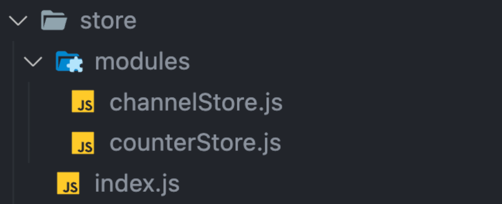
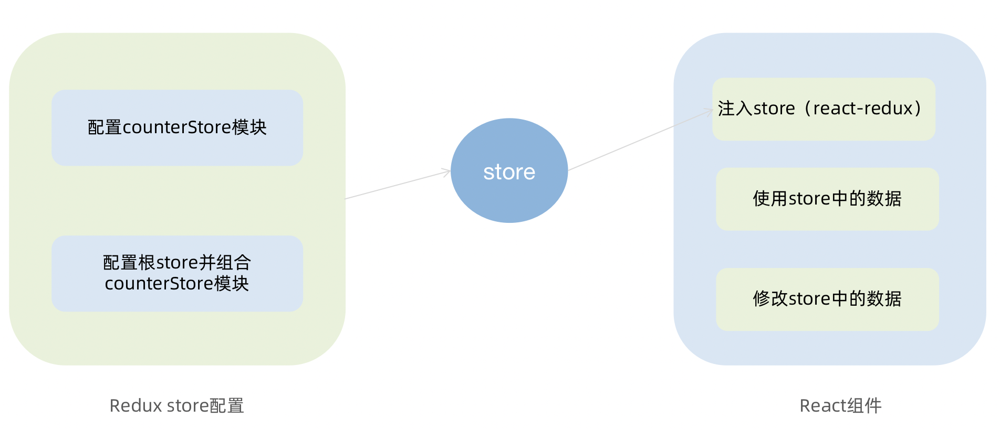

## 一、Redux 介绍

> <Pronounce word="Redux" /> 是 React 最常用的集中状态管理工具，类似于 Vue 中的 Pinia（Vuex），可以独立于框架运行

作用：通过集中管理的方式管理应用的状态


**为什么要使用 Redux？**

1. 独立于组件，无视组件之间的层级关系，简化通信问题
2. 单项数据流清晰，易于定位 bug
3. 调试工具配套良好，方便调试

## 二、Redux 数据流

> Redux 的难点是理解它对于数据修改的规则, 下图动态展示了在整个数据的修改中数据的流向


为了职责清晰，Redux 代码被分为三个核心的概念，我们学 redux，其实就是学这三个核心概念之间的配合，三个概念分别是:

-  `state`: 一个对象，存放着我们管理的数据
-  `action`: 一个对象，用来描述你想怎么改数据
-  `reducer`: 一个函数，根据 action 的描述更新 state

## 三、环境准备

> Redux 虽然是一个框架无关可以独立运行的插件，但是社区通常还是把它与 React 绑定在一起使用，以一个计数器案例体验一下 Redux + React 的基础使用

### 1. 配套工具

> 在 React 中使用 redux，官方要求安装以下两个插件

1. `Redux Toolkit（RTK）`- 官方推荐编写 Redux 逻辑的方式，是一套工具的集合集，简化书写方式

2. `react-redux` - 用来 连接 Redux 和 React 组件 的中间件


### 2. 配置基础环境

1.  使用 CRA 快速创建 React 项目

```bash
npx create-react-app my-redux
```

2.  安装配套工具

```bash
npm i @reduxjs/toolkit  react-redux
```

3.  启动项目

```bash
npm run start
```

### 3. store 目录结构设计



1. 通常集中状态管理的部分都会单独创建一个单独的 `store` 目录

2. 应用通常会有很多个子 store 模块，所以创建一个 `modules` 目录，在内部编写业务分类的子 store

3. store 中的入口文件 `index.js` 的作用是组合 modules 中所有的子模块，并导出 store

## 四、实现 counter 模块

### 1. 整体路径熟悉



### 2. 使用 React Toolkit 创建 counterStore

::: code-group
```javascript [store/modules/counterStore.js]
import { createSlice } from "@reduxjs/toolkit";

const counterStore = createSlice({
  // 模块名称独一无二
  name: "counter",
  // 初始数据
  initialState: {
    count: 1,
  },
  // 修改数据的同步方法
  reducers: {
    increment(state) {
      state.count++;
    },
    decrement(state) {
      state.count--;
    },
  },
});
// 解构出actionCreater
const { increment, decrement } = counter.actions;

// 导出修改方法
export { increment, decrement };
// 默认导出reducer函数
export default counterStore.reducer;
```

```javascript [store/index.js]
import { configureStore } from "@reduxjs/toolkit";

import counterReducer from "./modules/counterStore";

export default configureStore({
  reducer: {
    // 注册子模块
    counter: counterReducer,
  },
});
```
:::

### 3. 为 React 注入 store

> `react-redux`内置 `Provider` 组件，负责把 Redux 和 React 连接 起来。通过 store 参数把创建好的 store 实例注入到应用中，链接正式建立

```jsx
import React from "react";
import ReactDOM from "react-dom/client";
import App from "./App";
// 导入store
import store from "./store";
// 提供组件Provider
import { Provider } from "react-redux";

ReactDOM.createRoot(document.getElementById("root")).render(
  // 提供store数据
  <Provider store={store}>
    <App />
  </Provider>
);
```

### 4. React 组件使用 store 中的数据

> 在 React 组件中使用 store 中的数据，需要用到一个钩子函数 `useSelector`，它的作用是把 store 中的数据映射到组件中，使用样例如下：


### 5. React 组件修改 store 中的数据

> React 组件中修改 store 中的数据需要借助另外一个 hook 函数 <Pronounce word="useDispatch" />，它的作用是生成提交 action 对象的 dispatch 函数，使用样例如下：


## 五、提交 action 传参

> [!NOTE] 需求
> 组件中有两个按钮 `add to 10` 和 `add to 20` 可以直接把 count 值修改到对应的数字，目标 count 值是在组件中传递过去的，需要在提交 action 的时候传递参数


实现方式：在 reducers 的同步修改方法中添加 `action` 对象参数，在调用 actionCreater 的时候传递参数，参数会被传递到 action 对象 `payload` 属性上


## 六、异步 action 处理

**需求理解**


**实现步骤**

1. 创建 store 的写法保持不变，配置好同步修改状态的方法
2. 单独封装一个函数，在函数内部 return 一个新函数，在新函数中

   - 封装异步请求并获取数据
   - 调用同步 actionCreater 传入异步数据生成一个 `action` 对象，并使用 dispatch 提交
3. 组件中 dispatch 的写法保持不变

**代码实现**

> 测试接口地址： [http://geek.itheima.net/v1_0/channels](http://geek.itheima.net/v1_0/channels')

```javascript
import { createSlice } from "@reduxjs/toolkit";
import axios from "axios";

const channelStore = createSlice({
  name: "channel",
  initialState: {
    channelList: [],
  },
  reducers: {
    setChannelList(state, action) {
      state.channelList = action.payload;
    },
  },
});

const { setChannelList } = channelStore.actions;

// 创建异步
const url = "http://geek.itheima.net/v1_0/channels";
// 封装一个函数 在函数中return一个新函数 在新函数中封装异步
// 得到数据之后通过dispatch函数 触发修改
const fetchChannelList = () => {
  return async (dispatch) => {
    const res = await axios.get(url);
    dispatch(setChannelList(res.data.data.channels));
  };
};

export { fetchChannelList };
export default channelStore.reducer;
```

```jsx
import { useEffect } from "react";
import { useSelector, useDispatch } from "react-redux";
import { fetchChannelList } from "./store/channelStore";

function App() {
  // 使用数据
  const { channelList } = useSelector((state) => state.channel);
  useEffect(() => {
    dispatch(fetchChannelList());
  }, []);

  return (
    <div className="App">
      <ul>
        {channelList.map((task) => (
          <li key={task.id}>{task.name}</li>
        ))}
      </ul>
    </div>
  );
}

export default App;
```

## 七、RTK Query一体化方案

> RTK Query 是 Redux Toolkit 内置的高级数据获取和缓存库,专门为处理服务端数据而设计

### 1. RTK Query 核心特性

- **自动缓存管理**: 自动缓存请求结果,避免重复请求相同数据
- **内置状态管理**: 自动跟踪请求状态(isLoading, isFetching)
- **错误处理**: 内置错误处理机制
- **代码简化**: 自动生成 hooks,减少样板代码

### 2. RTK Query 基本使用

#### 步骤1: 创建 API slice

```javascript
// store/modules/channelApi.js
import { createApi, fetchBaseQuery } from '@reduxjs/toolkit/query/react'

export const channelApi = createApi({
  // reducer路径
  reducerPath: 'channelApi',
  // 基础配置
  baseQuery: fetchBaseQuery({
    baseUrl: 'http://geek.itheima.net/v1_0/'
  }),
  // 定义接口端点
  endpoints: (builder) => ({
    getChannels: builder.query({
      query: () => 'channels',
    }),
  }),
})

// 自动生成的 hook
export const { useGetChannelsQuery } = channelApi
```

#### 步骤2: 在 store 中注册 API slice

```javascript
// store/index.js
import { configureStore } from "@reduxjs/toolkit";
import { channelApi } from "./modules/channelApi";

export default configureStore({
  reducer: {
    // 注册 API reducer
    [channelApi.reducerPath]: channelApi.reducer,
  },
  // 添加 API middleware
  middleware: (getDefaultMiddleware) =>
    getDefaultMiddleware().concat(channelApi.middleware),
});
```

#### 步骤3: 在组件中使用

```jsx
import { useGetChannelsQuery } from './store/modules/channelApi'

function App() {
  // 自动处理 loading/error/data
  const { data, isLoading, error } = useGetChannelsQuery()

  if (isLoading) return <div>加载中...</div>
  if (error) return <div>出错了</div>

  return (
    <ul>
      {data?.data.channels?.map(item => (
        <li key={item.id}>{item.name}</li>
      ))}
    </ul>
  )
}
```

### 3. RTK Query vs Axios 方案对比

| 对比项 | Axios 方案 | RTK Query 方案 |
|--------|------------------|----------------|
| **状态管理** | 需手动编写 reducer 管理数据 | 自动管理,无需编写 reducer |
| **异步处理** | 需手动编写 async action 函数 | 自动生成,自动处理异步 |
| **缓存机制** | 无缓存机制 | 内置智能缓存系统 |
| **Loading状态** | 需手动在 reducer 中管理 | 自动提供 isLoading, isFetching |
| **错误处理** | 需手动 try-catch | 自动提供 error 状态 |
| **重复请求** | 可能触发重复请求 | 自动去重,避免重复请求 |
| **代码量** | 较多(需写 store、async action、reducer) | 较少(只需定义 API endpoint) |
| **组件使用** | dispatch(action) + useEffect | 直接使用生成的 hook |
| **数据刷新** | 需手动 dispatch | 提供 refetch 方法 |

### 4. Axios 方案代码示例

```javascript
// 需要: slice定义 + reducer + async action + 组件中手动调用
import { createSlice } from "@reduxjs/toolkit";
import axios from "axios";

const channelStore = createSlice({
  name: "channel",
  initialState: { channelList: [] },
  reducers: {
    setChannelList(state, action) {
      state.channelList = action.payload;
    },
  },
});

const fetchChannelList = () => {
  return async (dispatch) => {
    const res = await axios.get(url);
    dispatch(setChannelList(res.data.data.channels));
  };
};

// 组件中
useEffect(() => {
  dispatch(fetchChannelList());
}, []);
```

### 5. RTK Query 方案代码示例

```javascript
// 只需: 定义 API slice + 组件中使用 hook
import { createApi, fetchBaseQuery } from '@reduxjs/toolkit/query/react'

export const channelApi = createApi({
  reducerPath: 'channelApi',
  baseQuery: fetchBaseQuery({ baseUrl }),
  endpoints: (builder) => ({
    getChannels: builder.query({
      query: () => 'channels',
    }),
  }),
});

// 组件中
const { data } = useGetChannelsQuery()
```

### 6. RTK Query 高级用法

#### 6.1 动态参数

```javascript
endpoints: (builder) => ({
  // 带参数的查询
  getArticle: builder.query({
    query: (id) => `articles/${id}`,
  }),
})

// 组件中使用
const { data } = useGetArticleQuery(articleId)
```

#### 6.2 手动触发请求

```javascript
endpoints: (builder) => ({
  // 变更操作(POST/PUT/DELETE)
  createArticle: builder.mutation({
    query: (data) => ({
      url: 'articles',
      method: 'POST',
      body: data,
    }),
  }),
})

// 组件中使用
const [createArticle, { isLoading }] = useCreateArticleMutation()

const handleSubmit = async () => {
  await createArticle(articleData)
}
```

#### 6.3 重新获取数据

```javascript
// 自动 hook
const { data, refetch } = useGetChannelsQuery()

// 手动刷新
const handleRefresh = () => {
  refetch()
}
```

### 7. 选择建议

**选择 RTK Query 的场景:**
- 需要处理大量服务端数据
- 需要缓存机制提升性能
- 中大型项目,需要优化代码结构
- 团队协作,需要统一的数据管理方案

**选择 Axios 方案的场景:**
- 需要完全控制请求流程
- 简单的异步操作
- 不需要缓存功能
- 小型项目或学习理解 Redux 原理

## 八、Redux 调试 - devtools

> Redux 官方提供了针对于 Redux 的浏览器调试工具`Redux DevTools`，支持实时 state 信息展示、action 提交信息查看等


## 九、美团小案例

> [!NOTE] 开发思路
> 使用 RTK（Redux Toolkit）来管理应用状态, 组件负责 数据渲染 和 dispatch action。

### 1. 案例演示


### 2. 准备并熟悉环境

1.  克隆项目到本地（内置了基础静态组件和模版）

```bash
git clone http://git.itcast.cn/heimaqianduan/redux-meituan.git
```

2.  安装所有依赖

```bash
npm i
```

3.  启动 mock 服务（内置了 json-server）

```bash
npm run serve
```

4.  启动前端服务

```bash
npm run start
```

### 3. 分类和商品列表渲染


1- 编写 store 逻辑

```javascript
// 编写store
import { createSlice } from "@reduxjs/toolkit";
import axios from "axios";

const foodsStore = createSlice({
  name: "foods",
  initialState: {
    // 商品列表
    foodsList: [],
  },
  reducers: {
    // 更改商品列表
    setFoodsList(state, action) {
      state.foodsList = action.payload;
    },
  },
});

// 异步获取部分
const { setFoodsList } = foodsStore.actions;
const fetchFoodsList = () => {
  return async (dispatch) => {
    // 编写异步逻辑
    const res = await axios.get("http://localhost:3004/takeaway");
    // 调用dispatch函数提交action
    dispatch(setFoodsList(res.data));
  };
};

export { fetchFoodsList };

export default foodsStore.reducer;
```

2- 组件使用 store 数据

```jsx
// 省略部分代码
import { useDispatch, useSelector } from "react-redux";
import { fetchFoodsList } from "./store/modules/takeaway";
import { useEffect } from "react";

const App = () => {
  // 触发action执行
  // 1. useDispatch -> dispatch 2. actionCreater导入进来 3.useEffect
  const dispatch = useDispatch();
  const foodsList = useSelector(state => state.takeaway.foodsList)
  useEffect(() => {
    dispatch(fetchFoodsList());
  }, [dispatch]);

  return (
    <div className="home">
      {/* 导航 */}
      <NavBar />

      {/* 内容 */}
      <div className="content-wrap">
        <div className="content">
          <Menu />
          <div className="list-content">
            <div className="goods-list">
              {/* 外卖商品列表 */}
              {foodsList.map((item) => {
                return (
                  <FoodsCategory
                    key={item.tag}
                    // 列表标题
                    name={item.name}
                    // 列表商品
                    foods={item.foods}
                  />
                );
              })}
            </div>
          </div>
        </div>
      </div>
      {/* 购物车 */}
      <Cart />
    </div>
  );
};

export default App;
```

### 4. 点击分类激活交互实现


1- 编写 store 逻辑

```javascript
// 编写store

import { createSlice } from "@reduxjs/toolkit";
import axios from "axios";

const foodsStore = createSlice({
  name: "foods",
  initialState: {
    // 菜单激活下标值
    activeIndex: 0,
  },
  reducers: {
    // 更改activeIndex
    changeActiveIndex(state, action) {
      state.activeIndex = action.payload;
    },
  },
});

// 导出
const { changeActiveIndex } = foodsStore.actions;

export { changeActiveIndex };

const reducer = foodsStore.reducer;

export default reducer;
```

2- 编写组件逻辑

```jsx
import { useDispatch, useSelector } from 'react-redux';
import { setActiveIndex } from '../../store/modules/takeaway'

const Menu = () => {
  const { foodsList, activeIndex } = useSelector((state) => state.foods);
  const dispatch = useDispatch();
  const menus = foodsList.map((item) => ({ tag: item.tag, name: item.name }));
  return (
    <nav className="list-menu">
      {/* 添加active类名会变成激活状态 */}
      {menus.map((item, index) => {
        return (
          <div
            // 提交action切换激活index
            onClick={() => dispatch(changeActiveIndex(index))}
            key={item.tag}
            // 动态控制active显示
            className={classNames(
              "list-menu-item",
              activeIndex === index && "active"
            )}
          >
            {item.name}
          </div>
        );
      })}
    </nav>
  );
};
```

### 5. 商品列表切换显示


```jsx
<div className="list-content">
  <div className="goods-list">
    {/* 外卖商品列表 */}
    {foodsList.map((item, index) => {
      return (
        activeIndex === index && (
          <FoodsCategory
            key={item.tag}
            // 列表标题
            name={item.name}
            // 列表商品
            foods={item.foods}
          />
        )
      );
    })}
  </div>
</div>
```

### 6. 添加购物车实现


1- 编写 store 逻辑

```javascript
// 编写store

import { createSlice } from "@reduxjs/toolkit";
import axios from "axios";

const foodsStore = createSlice({
  name: "foods",
  initialState: {
    // 购物车列表
    cartList: []
  },
  reducers: {
    // 添加购物车
    addCart(state, action) {
      // 是否添加过？以action.payload.id去cartList中匹配 匹配到了 添加过
      const item = state.cartList.find((item) => item.id === action.payload.id);
      if (item) {
        item.count++;
      } else {
        state.cartList.push(action.payload);
      }
    },
  },
});

// 导出actionCreater
const { addCart } = foodsStore.actions;

export { addCart };

const reducer = foodsStore.reducer;

export default reducer;
```

2- 编写组件逻辑

```jsx
<div className="goods-count">
  {/* 添加商品 */}
  <span
    className="plus"
    onClick={() =>
      dispatch(
        addCart({
          id,
          picture,
          name,
          unit,
          description,
          food_tag_list,
          month_saled,
          like_ratio_desc,
          price,
          tag,
          count,
        })
      )
    }
  ></span>
</div>
```

### 7. 统计区域实现


实现思路

1. 基于 store 中的 cartList 的 length 渲染数量
2. 基于 store 中的 cartList 累加 price \* count
3. 购物车 cartList 的 length 不为零则高亮

```jsx
// 计算总价
const totalPrice = cartList.reduce((a, c) => a + c.price * c.count, 0);

{
  /* fill 添加fill类名购物车高亮*/
}
{
  /* 购物车数量 */
}
<div
  onClick={onShow}
  className={classNames("icon", cartList.length > 0 && "fill")}
>
  {cartList.length > 0 && (
    <div className="cartCornerMark">{cartList.length}</div>
  )}
</div>
{/* 购物车价格 */}
  <div className="main">
    <div className="price">
      <span className="payableAmount">
        <span className="payableAmountUnit">¥</span>
        {totalPrice}
      </span>
    </div>
    <span className="text">预估另需配送费 ¥5</span>
  </div>
```

### 8. 购物车列表功能实现


1-控制列表渲染

```jsx
const Cart = () => {
  return (
    <div className="cartContainer">
      {/* 添加visible类名 div会显示出来 */}
      <div className={classNames("cartPanel", "visible")}>
        {/* 购物车列表 */}
        <div className="scrollArea">
          {cartList.map((item) => {
            return (
              <div className="cartItem" key={item.id}>
                
                <div className="main">
                  <div className="skuInfo">
                    <div className="name">{item.name}</div>
                  </div>
                  <div className="payableAmount">
                    <span className="yuan">¥</span>
                    <span className="price">{item.price}</span>
                  </div>
                </div>
                <div className="skuBtnWrapper btnGroup">
                  {/* 数量组件 */}
                  <Count count={item.count} />
                </div>
              </div>
            );
          })}
        </div>
      </div>
    </div>
  );
};

export default Cart;
```

2- 购物车增减逻辑实现

```javascript
// count增
increCount (state, action) {
  // 关键点：找到当前要修改谁的count id
  const item = state.cartList.find(item => item.id === action.payload.id)
  item.count++
},
// count减
decreCount (state, action) {
  // 关键点：找到当前要修改谁的count id
  const item = state.cartList.find(item => item.id === action.payload.id)
  if (item.count === 0) {
    return
  }
  item.count--
}
```

```jsx
<div className="skuBtnWrapper btnGroup">
  {/* 数量组件 */}
  <Count
    count={item.count}
    onPlus={() => dispatch(increCount({ id: item.id }))}
    onMinus={() => dispatch(decreCount({ id: item.id }))}
  />
</div>
```

3-清空购物车实现

```javascript
// 清除购物车
clearCart (state) {
  state.cartList = []
}
```

```jsx
<div className="header">
  <span className="text">购物车</span>
  <span className="clearCart" onClick={() => dispatch(clearCart())}>
    清空购物车
  </span>
</div>
```

### 9. 控制购物车显示和隐藏


```jsx
// 控制购物车打开关闭的状态
const [visible, setVisible] = useState(false);

const onShow = () => {
  if (cartList.length > 0) {
    setVisible(true);
  }
};

{
  /* 遮罩层 添加visible类名可以显示出来 */
}
<div
  className={classNames("cartOverlay", visible && "visible")}
  onClick={() => setVisible(false)}
/>;
```
