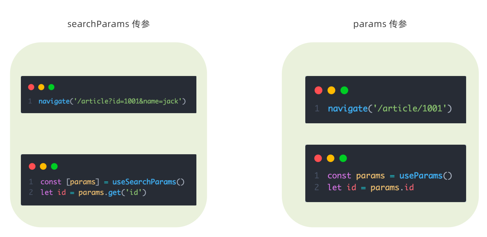

## 一、路由快速上手
### 1. 什么是前端路由
> 一个路径 `path` 对应一个组件 `component`， 当我们在浏览器中访问一个 path 的时候，path 对应的组件会在页面中进行渲染
<!--  -->

```js
const router = [
  {
    path:'/login',
    component: Login,
  },
  {
    path:'/article',
    component: Article,
  }
]
```

### 2. 创建路由开发环境
```bash
# 使用CRA创建项目
npm create-react-app react-router-pro

# 安装最新的ReactRouter包
npm i react-router-dom

# 启动项目
npm run start
```

### 3. 快速开始


```jsx
import ReactDOM from 'react-dom/client'
import { createBrowserRouter } from 'react-router-dom'

const router = createBrowserRouter([
  {
    path:'/login',
    element: <div>登录</div>
  },
  {
    path:'/article',
    element: <div>文章</div>
  }
])

ReactDOM.createRoot(document.getElementById('root')).render(
  <RouterProvider router={router}/>
)
```

## 二、抽象路由模块


-  创建页面
```js
// src/page/Login/index.js
const Login = () => {
  return (
    <div>
      我是登录页
    </div>
  )
}

export default Login
```

-  创建路由模块

```js
// src/router/index.js
import Login from '../page/Login'
import Article from '../page/Article'

import { createBrowserRouter, createHashRouter } from 'react-router-dom'

const router = createBrowserRouter([
  {
    path: '/',
    element: <Layout />,
  },
  {
    path: '/login',
    element: <Login />
  }
])

export default router
```

-  使用路由模块
```js
// src/index.js
import React from 'react'
import ReactDOM from 'react-dom/client'
import { RouterProvider } from 'react-router-dom'

// 1. 导入路由router
import router from './router'

const root = ReactDOM.createRoot(document.getElementById('root'))
root.render(
  <React.StrictMode>
    {/* 2. 路由绑定 */}
    <RouterProvider router={router}></RouterProvider>
  </React.StrictMode>
)


```

## 三、路由导航
### 1. 什么是路由导航
> 路由系统中的多个路由之间需要进行路由跳转，并且在跳转的同时可以传递参数进行通信


### 2. 声明式导航
> 声明式导航是指通过在模版中通过 `<Link/> ` 组件描述出要跳转到哪里去

比如后台管理系统的左侧菜单通常使用这种方式进行


::: tip
通过给组件的to属性指定要跳转到路由path，组件会被渲染为浏览器支持的 a 链接，如果需要传参直接通过字符串拼接的方式拼接参数即可
:::

### 3. 编程式导航
编程式导航是指通过 `useNavigate` 钩子得到导航方法，然后通过调用方法以命令式的形式进行路由跳转。比如想在登录请求完毕之后跳转就可以选择这种方式，更加灵活


::: tip
语法说明：通过调用navigate方法传入地址path实现跳转
:::

## 四、导航传参
<!--  -->

### 1. Params 传参（路径参数）

**跳转：**

```jsx
// 传参
navigate('/detail/123')

// 路由配置
<Route path="/detail/:id" element={<Detail />} />

// 接收
import { useParams } from 'react-router-dom'
const { id } = useParams()  // "123"
```

✅ **特点**：

* 参数写在路径里 `/detail/123`
* 刷新不丢失
* 一般用于唯一标识资源（如ID）


### 2. SearchParams 传参（查询参数）

**跳转：**

```jsx
// 传参
navigate('/detail?id=123&name=Tom')

// 接收
import { useSearchParams } from 'react-router-dom'
const [searchParams] = useSearchParams()
const id = searchParams.get('id')      // "123"
const name = searchParams.get('name')  // "Tom"
```

✅ **特点**：

* 参数写在 URL 查询字符串 `?key=value`
* 可传多个可选参数
* 刷新不丢失
* 适合筛选、搜索等场景

---


## 五、嵌套路由配置
### 1. 什么是嵌套路由
在一级路由中又内嵌了其他路由，这种关系就叫做**嵌套路由**。嵌套至一级路由内的路由又称作**二级路由**，例如：


### 2. 嵌套路由配置
> 实现步骤
>   1. 使用 `children`属性配置路由嵌套关系  
>   2. 使用 `<Outlet/>` 组件配置二级路由渲染位置


### 3. 默认二级路由
当访问的是一级路由时，默认的二级路由组件可以得到渲染，只需要在二级路由的位置去掉path，设置`index`属性为`true`


### 4. 404路由配置
> 场景：当浏览器输入url的路径在整个路由配置中都找不到对应的 path，为了用户体验，可以使用 **404组件**进行渲染

实现步骤：

1. 准备一个NotFound组件
2. 在路由表数组的末尾，以`*`号作为路由path配置路由


### 5. 两种路由模式
React Router 有两种常用路由模式：**BrowserRouter（history 模式）** 和 **HashRouter（hash 模式）**，区别简明如下：

| 对比项     | BrowserRouter（history 模式）                   | HashRouter（hash 模式）              |
| ------- | ------------------------------------------- | -------------------------------- |
| URL 格式  | `https://example.com/user/123`              | `https://example.com/#/user/123` |
| 原理      | HTML5 History API（pushState / replaceState） | URL hash（`#` 后的内容）               |
| 刷新行为    | 需要服务端支持，否则刷新可能 404                          | 刷新不会向服务端请求，天然防 404               |
| SEO 友好度 | 友好，URL 干净                                   | 不太友好，`#` 后内容搜索引擎可能忽略             |
| 部署要求    | 服务端需配置所有路由都返回 `index.html`                  | 无需特殊配置                           |
| 适用场景    | 后端可控、需良好 SEO 的项目                            | 静态托管或后端不可改的项目                    |

💡 口诀记忆：

* **BrowserRouter** → “干净 URL，需配后端”
* **HashRouter** → “带 #，前端自成一体”

---


