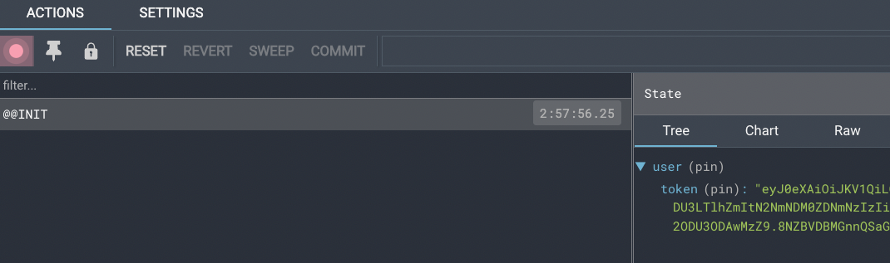

## 基本结构搭建


**实现步骤**

1. 在 `Login/index.js` 中创建登录页面基本结构
2. 在 Login 目录中创建 index.scss 文件，指定组件样式
3. 将 `logo.png` 和 `login.png` 拷贝到 assets 目录中

**代码实现**

::: code-group

```jsx [pages/Login/index.js]
import "./index.scss";
import { Card, Form, Checkbox, Input, Button } from "antd";
import logo from "@/assets/logo.png";

const Login = () => {
  return (
    <div className="login-container">
      <Card className="login-card" variant="borderless">
        <div className="card-header">
          
        </div>
        <div className="card-content">
          <Form name="basic">
            <Form.Item label={null} name="mobile">
              <Input placeholder="请输入手机号" prefix={<UserOutlined />} />
            </Form.Item>

            <Form.Item label={null} name="password">
              <Input.Password
                placeholder="请输入密码"
                prefix={<LockOutlined />}
              />
            </Form.Item>

            <Form.Item name="remember" valuePropName="checked" label={null}>
              <Checkbox>记住我？</Checkbox>
            </Form.Item>

            <Form.Item label={null} className="login-btn">
              <Button type="primary" htmlType="submit" block>
                点击登录
              </Button>
            </Form.Item>
          </Form>
        </div>
      </Card>
    </div>
  );
};

export default Login;
```

```css [index.scss]
.login-container {
  // background-color: #F1F7F6;
  background-image: url(../../assets/login_bg.svg);
  width: 100%;
  height: 100%;
  display: flex;
  justify-content: center;
  align-items: center;
  .login-card {
    width: 450px;
    height: 355px;
    /* 移动端适配 */
    @media (max-width: 768px) {
      width: 90%;
      height: 375px;
      max-width: 450px;
    }
    .card-header {
      width: 100%;
      height: 75px;
      display: flex;
      justify-content: center;
      .login-img {
        height: 100%;
      }
    }
    .card-content {
      margin-top: 20px;
      .login-btn {
        width: 100%;
        display: flex;
        justify-content: center;
        .ant-row {
          width: 100%;
        }
      }
    }
  }
}
```

:::

## 表单校验实现


**实现步骤**

1. 为 Form 组件添加 `validateTrigger` 属性，指定校验触发时机的集合
2. **为 Form.Item 组件添加 name 属性**
3. 为 Form.Item 组件添加 `rules` 属性，用来添加表单校验规则对象

**代码实现**
`page/Login/index.js`

```jsx
const Login = () => {
  return (
    <Form name="basic" validateTrigger="onBlur">
      <Form.Item
        label={null}
        name="mobile"
        rules={[
          { required: true, message: "请输入手机号!" },
          { pattern: /^1[3-9]\d{9}$/, message: "请输入正确的手机号!" },
        ]}
      >
        <Input placeholder="请输入手机号" prefix={<UserOutlined />} />
      </Form.Item>

      <Form.Item
        label={null}
        name="password"
        rules={[{ required: true, message: "请输入密码!" }]}
      >
        <Input.Password placeholder="请输入密码" prefix={<LockOutlined />} />
      </Form.Item>

      <Form.Item name="remember" valuePropName="checked" label={null}>
        <Checkbox>记住我？</Checkbox>
      </Form.Item>

      <Form.Item label={null} className="login-btn">
        <Button type="primary" htmlType="submit" block>
          点击登录
        </Button>
      </Form.Item>
    </Form>
  );
};
```

## 获取表单数据

**实现步骤**

1. 为 Form 组件添加 `onFinish` 属性，该事件会在点击登录按钮时触发
2. 创建 `onFinish` 函数，通过函数参数 values 拿到表单值
3. Form 组件添加 `initialValues` 属性，来初始化表单值

**代码实现**
`pages/Login/index.js`

```jsx
// 点击登录按钮时触发 参数values即是表单输入数据
const onFinish = (formValue) => {
  console.log(formValue);
};

<Form
  onFinish={onFinish}
  initialValues={{ remember: true, mobile: "13888888888", password: "246810" }}
>
  ...
</Form>;
```

<!--  -->

## 封装网络请求

> [!NOTE] 业务背景
> 前端需要向后端请求数据，而 [Axios](https://axios-http.com/zh/) 是一个基于 promise 网络请求库。

**实现步骤**

1. 安装 `axios` 到项目
2. 创建 `utils/http.js` 文件
3. 创建 axios 实例，进行网络请求配置

```bash
npm i axios
```

```javascript
import axios from "axios";

const http = axios.create({
  baseURL: "http://geek.itheima.net/v1_0",
  timeout: 5000,
});

// 添加请求拦截器
http.interceptors.request.use(
  (config) => {
    return config;
  },
  (error) => {
    return Promise.reject(error);
  }
);

// 添加响应拦截器
http.interceptors.response.use(
  (response) => {
    // 2xx 范围内的状态码都会触发该函数。
    // 对响应数据做点什么
    return response.data;
  },
  (error) => {
    // 超出 2xx 范围的状态码都会触发该函数。
    // 对响应错误做点什么
    return Promise.reject(error);
  }
);

export default http;
```

## 使用 Redux 管理 token

**安装 Redux 工具包**

```bash
npm i react-redux @reduxjs/toolkit
```

**配置用户状态**

::: code-group

```js [store/modules/user.js]
import { createSlice } from "@reduxjs/toolkit";
import { http } from "@/utils";
const userStore = createSlice({
  name: "user",
  // 数据状态
  initialState: {
    token: "",
  },
  // 同步修改方法
  reducers: {
    setUserInfo(state, action) {
      state.userInfo = action.payload;
    },
  },
});

// 解构出actionCreater
const { setUserInfo } = userStore.actions;

// 获取reducer函数
const userReducer = userStore.reducer;

// 异步方法封装
const fetchLogin = (loginForm) => {
  return async (dispatch) => {
    const res = await http.post("/authorizations", loginForm);
    dispatch(setToken(res.data.token));
    // 返回数据给组件使用
    return res;
  };
};

export { fetchLogin };

export default userReducer;
```

```js [store/index.js]
import { configureStore } from "@reduxjs/toolkit";

import userReducer from "./modules/user";

export default configureStore({
  reducer: {
    // 注册子模块
    user: userReducer,
  },
});
```

:::

## 实现登录逻辑

> [!NOTE] 业务逻辑：
> 1. 跳转到首页
> 2. 提示用户登录成功

```jsx
import { message } from 'antd'
import useStore from '@/store'
import { fetchLogin } from '@/store/modules/user'
import { useDispatch } from 'react-redux'

const Login = () => {
  const dispatch = useDispatch()
  const navigate = useNavigate()
  const onFinish = (values) => {
    console.log("Success:", values);
    const loginForm = {
      mobile: values.mobile,
      code: values.password,
    };
    dispatch(fetchLogin(loginForm)).then((res) => {
      console.log('res-->>>', res);
      if (res.message === "OK") {
        message.success("登录成功");
        navigate("/");
      } else {
        message.error(res.msg);
      }
    });
  };
  return (
    <div className="login">
     <!-- 省略... -->
    </div>
  )
}

export default Login
```

## token 持久化

> [!NOTE] 业务背景
> 基于 Redux 的存储方式是基于内存的，刷新就会丢失，为了Token持久化，我们需要做本地存储

**实现持久化逻辑**

```javascript
const userStore = createSlice({
  name: "user",
  // 数据
  initialState: {
    token: localStorage.getItem('token') || "",
  },
  // 同步修改方法
  reducers: {
    setUserInfo(state, action) {
      state.token = action.payload;
      // 存入本地
      localStorage.setItem('token', action.payload);
    },
  },
});
```

刷新浏览器，通过 Redux 调试工具查看 token 数据


## 请求拦截器注入 token

> [!NOTE] 业务背景
> Token 作为用户的数据标识，在接口层面起到了接口权限控制的作用。也就是说后端有很多接口都需要通过查看当前请求头信息中是否含有 token 数据，来决定是否正常返回数据


> 拼接方式：config.headers.Authorization = `Bearer ${token}}`

`utils/request.js`

```javascript
// 添加请求拦截器
request.interceptors.request.use((config) => {
  const token = localStorage.getItem("token");
  if (token) {
    config.headers.Authorization = `Bearer ${token}`;
  }
  return config;
});
```

## 路由鉴权实现

> [!NOTE] 业务背景
> 封装 `AuthRoute` 路由鉴权高阶组件，实现未登录拦截，并跳转到登录页面

**实现思路**
- 判断本地是否有 `token`，如果有，就返回子组件，否则就重定向到登录 `Login`

**实现步骤**

1. 在 components 目录中，创建 `AuthRoute/index.jsx` 文件
2. 登录时，直接渲染相应页面组件
3. 未登录时，重定向到登录页面
4. 将需要鉴权的页面路由配置，替换为 AuthRoute 组件渲染

**代码实现**

::: code-group
```jsx [components/AuthRoute/index.jsx]
import { getToken } from "@/utils";
import { Navigate } from "react-router-dom";

const AuthRoute = ({ children }) => {
  const isToken = getToken();
  if (isToken) {
    return <>{children}</>;
  } else {
    return <Navigate to="/login" replace />;
  }
};

export default AuthRoute;
```

```jsx [router/index.js]
import { createBrowserRouter } from "react-router-dom";

import Login from "@/pages/Login";
import Layout from "@/pages/Layout";
import AuthRoute from "@/components/Auth";

const router = createBrowserRouter([
  {
    path: "/",
    element: (
      <AuthRoute>
        <Layout />
      </AuthRoute>
    ),
  },
  {
    path: "/login",
    element: <Login />,
  },
]);

export default router;
```
:::