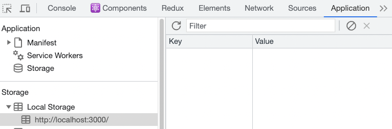

## 静态结构搭建


**实现步骤**

1. 在 `Layout/index.js` 中创建布局页面基本结构
2. 在 Layout 目录中创建 index.scss 文件，指定组件样式
3. 将 `logo.png` 拷贝到 assets 目录中

**代码实现**

::: code-group

```jsx [pages/Layout/index.jsx]
import React, { useState } from "react";
import {
  MenuFoldOutlined,
  MenuUnfoldOutlined,
  FormOutlined,
  HomeOutlined,
  DiffOutlined,
  DownOutlined,
  UserOutlined,
  PoweroffOutlined,
} from "@ant-design/icons";
import { Button, Layout, Menu, theme, Dropdown, message, Space } from "antd";
import "./index.scss";
import logo from "@/assets/logo.png";

const { Header, Sider, Content } = Layout;
function Layouts() {
  const [collapsed, setCollapsed] = useState(false);
  // 从 Ant Design 的主题中提取出背景色和圆角半径的变量
  const {
    token: { colorBgContainer, borderRadiusLG },
  } = theme.useToken();
  const handleDropdownItemClick = ({ key }) => {
    message.info(`Click on item ${key}`);
  };
  const dropItems = [
    {
      label: "个人中心",
      key: "1",
      icon: <UserOutlined />,
    },
    {
      label: "退出登录",
      key: "2",
      icon: <PoweroffOutlined />,
    },
  ];
  return (
    <>
      <Layout>
        <Sider trigger={null} collapsible collapsed={collapsed}>
          <div className="logo-vertical">
            
          </div>
          <Menu
            theme="dark"
            mode="inline"
            defaultSelectedKeys={["1"]}
            items={[
              {
                key: "1",
                icon: <HomeOutlined />,
                label: "首页",
              },
              {
                key: "2",
                icon: <DiffOutlined />,
                label: "文章管理",
              },
              {
                key: "3",
                icon: <FormOutlined />,
                label: "发布文章",
              },
            ]}
          />
        </Sider>
        <Layout>
          <Header style={{ padding: 0, background: colorBgContainer }}>
            <Button
              type="text"
              icon={collapsed ? <MenuUnfoldOutlined /> : <MenuFoldOutlined />}
              onClick={() => setCollapsed(!collapsed)}
              style={{
                fontSize: "16px",
                width: 64,
                height: 64,
              }}
            />
            <div className="header-right">
              <Dropdown
                menu={{ items: dropItems, onClick: handleDropdownItemClick }}
              >
                <a onClick={(e) => e.preventDefault()}>
                  <Space>
                    你好, 管理员
                    <DownOutlined />
                  </Space>
                </a>
              </Dropdown>
            </div>
          </Header>
          <Content
            style={{
              margin: "24px 16px",
              padding: 24,
              minHeight: 280,
              background: colorBgContainer,
              borderRadius: borderRadiusLG,
            }}
          >
            Content
          </Content>
        </Layout>
      </Layout>
    </>
  );
}

export default Layouts;
```

```css [index.scss]
.ant-layout {
  height: 100%;

  .logo-vertical {
    width: 100%;
    display: flex;
    justify-content: center;
    .layout-img {
      width: 80%;
    }
  }

  .ant-layout-header {
    display: flex;
    justify-content: space-between;
    .header-right {
      width: 120px;
    }
  }
}
```

:::

## 二级路由配置

**实现思路**

1. 创建二级路由组件
2. 在 `router/index.js` 中配置二级路由
3. 配置二级路由出口

**代码实现**

::: code-group

```jsx [pages/Home/index.jsx]
const Home = () => {
  return <div>Home</div>;
};
export default Home;
```

```jsx [Article/index.jsx]
const Article = () => {
  return <div>Article</div>;
};
export default Article;
```

```jsx [Publish/index.jsx]
const Publish = () => {
  return <div>Publish</div>;
};
export default Publish;
```

:::

`router/index.js`

```jsx
import { createBrowserRouter } from "react-router-dom";

import Login from "@/pages/Login";
import Layout from "@/pages/Layout";
import Publish from "@/pages/Publish";
import Article from "@/pages/Article";
import Home from "@/pages/Home";
import { AuthRoute } from "@/components/Auth";

const router = createBrowserRouter([
  {
    path: "/",
    element: (
      <AuthRoute>
        <Layout />
      </AuthRoute>
    ),
    children: [
      {
        index: true,
        element: <Home />,
      },
      {
        path: "article",
        element: <Article />,
      },
      {
        path: "publish",
        element: <Publish />,
      },
    ],
  },
  {
    path: "/login",
    element: <Login />,
  },
]);

export default router;
```

配置二级路由出口
::: code-group

```jsx [Layout/index.jsx]
import { Outlet } from "react-router-dom";

<Layout className="layout-content" style={{ padding: 20 }}>
  <Outlet />
</Layout>;
```

:::

## 点击菜单跳转路由

**实现思路**

1. 获取当前路由信息
2. 获取当前路由的 key
3. 跳转路由


**代码实现**

```jsx
import { Outlet, useNavigate } from "react-router-dom";

const items = [
  {
    label: "首页",
    key: "/",
    icon: <HomeOutlined />,
  },
  {
    label: "文章管理",
    key: "/article",
    icon: <DiffOutlined />,
  },
  {
    label: "创建文章",
    key: "/publish",
    icon: <EditOutlined />,
  },
];

const GeekLayout = () => {
  const navigate = useNavigate();
  const menuClick = (route) => {
    navigate(route.key);
  };
  return (
    <Menu
      mode="inline"
      theme="dark"
      selectedKeys={selectedKey}
      items={items}
      style={{ height: "100%", borderRight: 0 }}
      onClick={menuClick}
    />
  );
};
export default GeekLayout;
```

## 菜单反向高亮

**实现思路**

1. 获取当前路由信息
2. 获取当前路由的 key
3. 通过 key 匹配菜单的 key，设置菜单的选中状态

**代码实现**

```jsx {25}
import { useLocation } from "react-router-dom";
const GeekLayout = () => {
  // 省略部分代码
  const location = useLocation();
  const selectedKey = location.pathname;

  return (
    <Layout>
      <Header className="header">
        <div className="logo" />
        <div className="user-info">
          <span className="user-name">{name}</span>
          <span className="user-logout">
            <Popconfirm title="是否确认退出？" okText="退出" cancelText="取消">
              <LogoutOutlined /> 退出
            </Popconfirm>
          </span>
        </div>
      </Header>
      <Layout>
        <Sider width={200} className="site-layout-background">
          <Menu
            mode="inline"
            theme="dark"
            selectedKeys={selectedKey}
            items={items}
            style={{ height: "100%", borderRight: 0 }}
            onClick={menuClickHandler}
          ></Menu>
        </Sider>
        <Layout className="layout-content" style={{ padding: 20 }}>
          <Outlet />
        </Layout>
      </Layout>
    </Layout>
  );
};
```

## 展示个人信息


**实现步骤**

1. 在 Redux 的 store 中编写获取用户信息的相关逻辑
2. 在 Layout 组件中触发 action 的执行
3. 在 Layout 组件使用使用 store 中的数据进行用户名的渲染

**代码实现**
`store/userStore.js`

```javascript
import { createSlice } from "@reduxjs/toolkit";
import { http } from "@/utils/request";
import { getToken, setToken } from "@/utils";
const userStore = createSlice({
  name: "user",
  // 数据
  initialState: {
    token: getToken() || "",
    userInfo: {},
  },
  // 同步修改方法
  reducers: {
    setUserToken(state, action) {
      state.token = action.payload;
      // 存入本地
      setToken(state.token);
    },
    setUserInfo(state, action) {
      state.userInfo = action.payload;
    },
  },
});

// 解构出actionCreater
const { setUserToken, setUserInfo } = userStore.actions;

// 获取reducer函数
const userReducer = userStore.reducer;

const fetchLogin = (loginForm) => {
  return async (dispatch) => {
    const res = await http.post("/authorizations", loginForm);
    dispatch(setUserToken(res.data.token));
  };
};

const fetchUserInfo = () => {
  return async (dispatch) => {
    const res = await http.get("/user/profile");
    dispatch(setUserInfo(res.data));
  };
};

export { fetchLogin, fetchUserInfo };

export default userReducer;
```

`pages/Layout/index.js`

```jsx
// 省略部分代码
import { fetchUserInfo } from "@/store/modules/user";
import { useDispatch, useSelector } from "react-redux";

const GeekLayout = () => {
  const dispatch = useDispatch();
  const name = useSelector((state) => state.user.userInfo.name);
  useEffect(() => {
    dispatch(fetchUserInfo());
  }, [dispatch]);
  return (
    <Layout>
      <Header className="header">
        <div className="logo" />
        <div className="user-info">
          <span className="user-name">{name}</span>
          <span className="user-logout">
            <Popconfirm title="是否确认退出？" okText="退出" cancelText="取消">
              <LogoutOutlined /> 退出
            </Popconfirm>
          </span>
        </div>
      </Header>
      <Layout>
        <Sider width={200} className="site-layout-background">
          <Menu
            mode="inline"
            theme="dark"
            defaultSelectedKeys={["1"]}
            items={items}
            style={{ height: "100%", borderRight: 0 }}
          ></Menu>
        </Sider>
        <Layout className="layout-content" style={{ padding: 20 }}>
          <Outlet />
        </Layout>
      </Layout>
    </Layout>
  );
};
export default GeekLayout;
```

## 退出登录实现


**实现步骤**

1. 为弹窗确认框添加确认回调事件
2. 在`store/userStore.js` 中新增退出登录的 action 函数，在其中删除 token
3. 在回调事件中，调用 userStore 中的退出 action
4. 清除用户信息，返回登录页面

**代码实现**

::: code-group

```js [store/modules/user.js]
import { createSlice } from "@reduxjs/toolkit";
import { http } from "@/utils/request";
import { clearToken, getToken, setToken } from "@/utils";
const userStore = createSlice({
  name: "user",
  // 数据
  initialState: {
    token: getToken() || "",
  },
  // 同步修改方法
  reducers: {
    clearUserInfo(state) {
      state.token = "";
      clearToken();
    },
  },
});

// 解构出actionCreater
const { clearUserInfo } = userStore.actions;

// 获取reducer函数
const userReducer = userStore.reducer;

export { clearUserInfo };

export default userReducer;
```

```jsx [pages/Layout/index.jsx]
import React, { useState } from "react";
import { ExclamationCircleFilled } from "@ant-design/icons";
import { Modal } from "antd";
import "./index.scss";
import { useNavigate } from "react-router-dom";
import { clearUserInfo } from "@/store/modules/user";
import { useDispatch } from "react-redux";

const { confirm } = Modal;
function Layouts() {
  const dispatch = useDispatch();
  const navigate = useNavigate();

  const handleDropdownItemClick = ({ key }) => {
    // message.info(`Click on item ${key}`);
    if (key === "2") {
      // 确认退出登录
      confirm({
        title: "警告",
        icon: <ExclamationCircleFilled />,
        content: "是否确认退出登录?",
        okText: "确定",
        okType: "danger",
        cancelText: "取消",
        onOk() {
          console.log("OK");
          // 退出登录
          dispatch(clearUserInfo());
          navigate("/login");
        },
        onCancel() {
          console.log("Cancel");
        },
      });
    }
  };

  const dropItems = [
    {
      label: "个人中心",
      key: "1",
      icon: <UserOutlined />,
    },
    {
      label: "退出登录",
      key: "2",
      icon: <PoweroffOutlined />,
    },
  ];
  return (
    <>
        ...
        <Layout>
          <Header style={{ padding: 0, background: colorBgContainer }}>
            <div className="header-right">
              <Dropdown
                menu={{ items: dropItems, onClick: handleDropdownItemClick }}
              >
                <a onClick={(e) => e.preventDefault()}>
                  <Space>
                    你好, 管理员
                    <DownOutlined />
                  </Space>
                </a>
              </Dropdown>
            </div>
          </Header>
        </Layout>
    </>
  );
}

export default Layouts;
```

:::


## 处理 Token 失效

> [!NOTE] 业务背景
> 如果用户一段时间不做任何操作，到时之后应该清除所有过期用户信息跳回到登录

```javascript
http.interceptors.response.use(
  (response) => {
    // 2xx 范围内的状态码都会触发该函数。
    // 对响应数据做点什么
    return response.data;
  },
  (error) => {
    // 超出 2xx 范围的状态码都会触发该函数。
    // 对响应错误做点什么
    console.dir(error);
    if (error.response.status === 401) {
      clearToken();
      router.navigate("/login");
      window.location.reload();
    }

    return Promise.reject(error);
  }
);
```

## 首页 Home 图表展示


## 图表基础实现

> [!NOTE] 实现步骤
> 1. 生成echarts实例
> 2. 准备图表参数
> 3. 渲染参数

**安装 echarts**

```bash
npm i echarts
```

**实现基础**

```jsx
import { useEffect, useRef } from "react";
import * as echarts from "echarts";

const Home = () => {
  const chartRef = useRef(null);
  useEffect(() => {
    // 1. 生成实例
    const myChart = echarts.init(chartRef.current);
    // 2. 准备图表参数
    const option = {
      xAxis: {
        type: "category",
        data: ["Mon", "Tue", "Wed", "Thu", "Fri", "Sat", "Sun"],
      },
      yAxis: {
        type: "value",
      },
      series: [
        {
          data: [120, 200, 150, 80, 70, 110, 130],
          type: "bar",
        },
      ],
    };
    // 3. 渲染参数
    myChart.setOption(option);
  }, []);

  return (
    <div>
      <div ref={chartRef} style={{ width: "400px", height: "300px" }} />
    </div>
  );
};

export default Home;
```

<!--  -->

## 图表组件封装

> [!NOTE] 封装思路
> 1. 创建图表组件，使用props对象接收参数
> 2. 父组件通过属性传递参数

::: code-group

```jsx [Home/components/charts.jsx]
import { useEffect, useRef } from "react";
import * as echarts from "echarts";

// 参数：title：标题, seriesType：图表类型, data：数据
const Charts = ({title, seriesType, data}) => {
  const chartRef = useRef(null);
  useEffect(() => {
    // 初始化图表
    const myChart = echarts.init(chartRef.current);
    // 准备图表参数
    const options = {
      title: {
        text: title,
      },
      xAxis: {
        type: "category",
        data: ["Mon", "Tue", "Wed", "Thu", "Fri", "Sat", "Sun"],
      },
      yAxis: {
        type: "value",
      },
      series: [
        {
          data: data || [150, 230, 224, 218, 135, 147, 260],
          type: seriesType || "line",
        },
      ],
    };
    // 渲染图表
    myChart.setOption(options);
  }, []);

  return <div ref={chartRef} style={{ width: "800px", height: "600px" }}></div>;
};
export default Charts;

```

```jsx [Home/index.jsx]
import Charts from "./components/charts"

const Home = () => {
  return <div className="home">
    <Charts title={'文章量-柱状图'} seriesType={'bar'} data={[60, 55, 45, 40, 50, 60, 70]} />
    <Charts title={'阅读量-折线图'}/>
  </div>
}
export default Home
```
:::