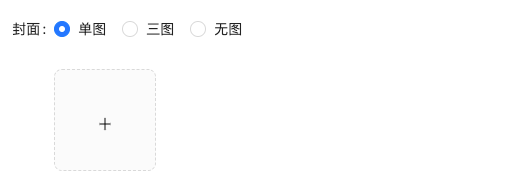

## 创建基础结构


::: code-group

```jsx [pages/Publish/index.jsx]
import { Breadcrumb, Button, Form, Input, Select } from "antd";
import { HomeOutlined, FormOutlined } from "@ant-design/icons";
const Publish = () => {
  // 获取一个表单实例
  const [editForm] = Form.useForm();
  const onFinish = (values) => {
    console.log("Success:", values);
  };
  const onFinishFailed = (errorInfo) => {
    console.log("Failed:", errorInfo);
  };
  const onReset = () => {
    editForm.resetFields();
  };
  return (
    <div className="publish">
      {/* 面包屑导航 */}
      <Breadcrumb
        items={[
          {
            title: (
              <>
                <HomeOutlined />
                <span>首页</span>
              </>
            ),
          },
          {
            title: (
              <>
                <FormOutlined />
                <span>发布文章</span>
              </>
            ),
          },
        ]}
      />
      <Form
        name="basic"
        form={editForm}
        labelCol={{ span: 8 }}
        wrapperCol={{ span: 16 }}
        style={{ maxWidth: 600 }}
        onFinish={onFinish}
        onFinishFailed={onFinishFailed}
        autoComplete="off"
      >
        <Form.Item
          label="标题"
          name="title"
          rules={[{ required: true, message: "请输入标题!" }]}
        >
          <Input placeholder="请输入标题" />
        </Form.Item>

        <Form.Item
          label="频道"
          name="channel_id"
          rules={[{ required: true, message: "请选择一个频道!" }]}
        >
          <Select
            showSearch
            placeholder="请选择频道"
            optionFilterProp="label"
            options={[
              {
                value: "1",
                label: "频道1",
              },
              {
                value: "2",
                label: "频道2",
              },
            ]}
          />
        </Form.Item>
        <Form.Item label="内容" name="content">
          <Input />
        </Form.Item>

        <Form.Item label={null}>
          <Button
            htmlType="button"
            onClick={onReset}
            style={{ marginRight: 10 }}
          >
            重置
          </Button>
          <Button type="primary" htmlType="submit">
            发布文章
          </Button>
        </Form.Item>
      </Form>
    </div>
  );
};
export default Publish;
```

:::

## 准备富文本编辑器


**实现步骤**

1. 安装富文本编辑器 `react-quill`
2. 导入富文本组件
3. 配置样式

**代码示例**

1. 安装 `react-quill`

> [!WARNING] 警告
> 因为 React18 + StrictMode 下 react-quill 内部依赖的 findDOMNode 已经被废弃了。
> 所以需要安装一个社区分支 `react-quill-new` 来解决这个问题。

```bash
npm i react-quill-new
```

2-导入富文本组件

::: code-group

```jsx [pages/Publish/index.jsx]
import ReactQuill from "react-quill-new";
import "react-quill-new/dist/quill.snow.css";

const Publish = () => {
  return (
    // ...
    <Form labelCol={{ span: 4 }} wrapperCol={{ span: 16 }}>
      <Form.Item label="内容" name="content">
        <ReactQuill
          className="publish-quill"
          theme="snow"
          placeholder="请输入文章内容"
        />
      </Form.Item>
    </Form>
  );
};
```

```css [index.scss]
.publish {
  .publish-quill .ql-container {
    height: 300px;
  }

  .publish-quill .ql-editor {
    height: 250px;
    /* 扣掉工具栏高度 */
    overflow-y: auto;
  }
}
```

:::

## 频道数据获取

**实现步骤**

1. 使用 `useState` 初始化数据和修改数据的方法
2. 在 `useEffect` 中调用接口并保存数据
3. 使用数据渲染对应模版

**代码实现**

```jsx
import { useEffect, useState } from "react";
import { http } from "@/utils/http";

// 频道列表
const [channels, setChannels] = useState([]);
// 获取频道列表
useEffect(() => {
  http.get("/channels").then((res) => {
    setChannels(res.data.channels);
  });
}, []);

// 模板渲染
return (
  <Form.Item
    label="频道"
    name="channel_id"
    rules={[{ required: true, message: "请选择一个频道!" }]}
  >
    <Select showSearch placeholder="请选择频道" optionFilterProp="label">
      {channels.map((item) => (
        <Select.Option key={item.id} value={item.id}>
          {item.name}
        </Select.Option>
      ))}
    </Select>
  </Form.Item>
);
```

## 发布文章

**实现步骤**

1. `onFinish`获取表单数据
2. 调用接口发布文章
3. 提示用户发布成功
4. 重置表单数据

```jsx
// 发布文章
const onFinish = (values) => {
  console.log("Success:", values);
  const { channel_id, content, title } = values;
  const params = {
    channel_id,
    content,
    title,
    type: 1,
    cover: {
      type: 1,
      images: [],
    },
  };
  http
    .post("/mp/articles?draft=false", params)
    .then((res) => {
      console.log(res);
      if (res.message === "OK") {
        message.success("发布成功！");
        editForm.resetFields();
      } else {
        message.error(res.message || "发布失败");
      }
    })
    .catch((err) => {
      console.log(err);
    });
};
```


> [!WARNING] 注意
> `resetFields` 重置表单方法需要通过 ref 获取到 Form 实例才能调用，并且表单项需要有 `name` 属性。

## 上传封面实现

### 准备上传结构



```tsx
<Form.Item label="封面">
  <Form.Item name="type">
    <Radio.Group>
      <Radio value={1}>单图</Radio>
      <Radio value={3}>三图</Radio>
      <Radio value={0}>无图</Radio>
    </Radio.Group>
  </Form.Item>
  <Upload listType="picture-card" showUploadList>
    <div style={{ marginTop: 8 }}>
      <PlusOutlined />
    </div>
  </Upload>
</Form.Item>
```

### 实现基础上传

**实现步骤**

1. 为 Upload 组件添加 `action 属性`，配置封面图片上传接口地址
2. 为 Upload 组件添加 `name属性`, 接口要求的字段名
3. 为 Upload 添加 `onChange 属性`，在事件中拿到当前图片数据，并存储到 React 状态中

**代码实现**

```jsx
import { useState } from "react";

const Publish = () => {
  // 上传图片
  const [imageList, setImageList] = useState([]);
  const onUploadChange = (info) => {
    setImageList(info.fileList);
  };
  return (
    <Form.Item label="封面">
      <Form.Item name="type">
        <Radio.Group>
          <Radio value={1}>单图</Radio>
          <Radio value={3}>三图</Radio>
          <Radio value={0}>无图</Radio>
        </Radio.Group>
      </Form.Item>
      <Upload
        name="image"
        listType="picture-card"
        showUploadList
        action={"http://geek.itheima.net/v1_0/upload"}
        onChange={onUploadChange}
      >
        <div style={{ marginTop: 8 }}>
          <PlusOutlined />
        </div>
      </Upload>
    </Form.Item>
  );
};
```

### 切换图片 Type

**实现步骤**

1. 点击单选框时拿到当前的类型 value
2. 根据 value 控制上传组件的显示（大于零时才显示）

```jsx
const Publish = () => {
  // 控制图片Type
  const [imageType, setImageType] = useState(0);

  const onTypeChange = (e) => {
    console.log(e);
    setImageType(e.target.value);
  };

  return (
    <FormItem>
      <Radio.Group onChange={onTypeChange}>
        <Radio value={1}>单图</Radio>
        <Radio value={3}>三图</Radio>
        <Radio value={0}>无图</Radio>
      </Radio.Group>
      {imageType > 0 && (
        <Upload
          name="image"
          listType="picture-card"
          showUploadList
          action={"http://geek.itheima.net/v1_0/upload"}
          onChange={onUploadChange}
        >
          <div style={{ marginTop: 8 }}>
            <PlusOutlined />
          </div>
        </Upload>
      )}
    </FormItem>
  );
};
```

### 控制最大上传图片数量

**实现步骤**

1. 通过 `maxCount` 属性限制图片的上传图片数量

```jsx {10}
{
  imageType > 0 && (
    <Upload
      name="image"
      listType="picture-card"
      className="avatar-uploader"
      showUploadList
      action={"http://geek.itheima.net/v1_0/upload"}
      onChange={onUploadChange}
      maxCount={imageType}
      multiple={imageType > 1}
    >
      <div style={{ marginTop: 8 }}>
        <PlusOutlined />
      </div>
    </Upload>
  );
}
```

## 发布带封面的文章

### 校验图片数量是否吻合

```jsx
// 发布文章
const onFinish = async (formValue) => {
  // 校验图片类型和数量是否吻合
  if (imageType > 0 && imageList.length !== imageType) {
    message.error("请上传正确的图片数量！");
    return;
  }
  const { channel_id, content, title } = formValue;
  const params = {
    channel_id,
    content,
    title,
    type: imageType,
    cover: {
      type: imageType,
      images: imageList.map((item) => item.response.data.url),
    },
  };
  await http.post("/mp/articles?draft=false", params);
  message.success("发布文章成功");
};
```

### 处理接口格式

```jsx {10}
// 发布文章
const onFinish = async (formValue) => {
  const { channel_id, content, title } = formValue;
  const params = {
    channel_id,
    content,
    title,
    type: imageType,
    cover: {
      type: imageType,
      images: imageList.map((item) => item.response.data.url),
    },
  };
  await http.post("/mp/articles?draft=false", params);
  message.success("发布文章成功");
};
```

### 发布结果展示

**实现步骤**
1. 定义一个状态变量，控制发布结果展示
2. 在发布成功时，将状态变量设置为 true


```jsx
const Publish = () => {
  // 定义文章是否发布
  const [isPublish, setIsPublish] = useState(false);
  // 确定发布
  const onFinish = () => {
    ...
    setIsPublish(true);
  }
  return (
    {!isPublish ? (<Form>...</Form>) : (
      <Result
          status="success"
          title="发布成功"
          subTitle="文章发布成功"
          extra={[
            <Button type="primary" key="console">
              查看文章
            </Button>,
            <Button key="buy" onClick={() => {setIsPublish(false)}}>继续发布</Button>,
          ]}
        />
    )}
  )
}

```
