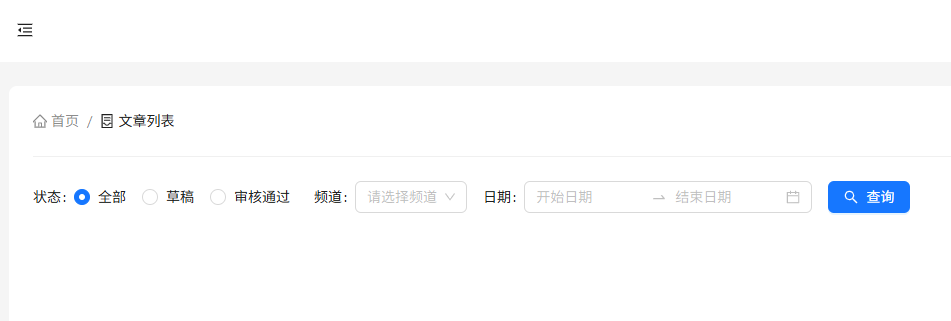
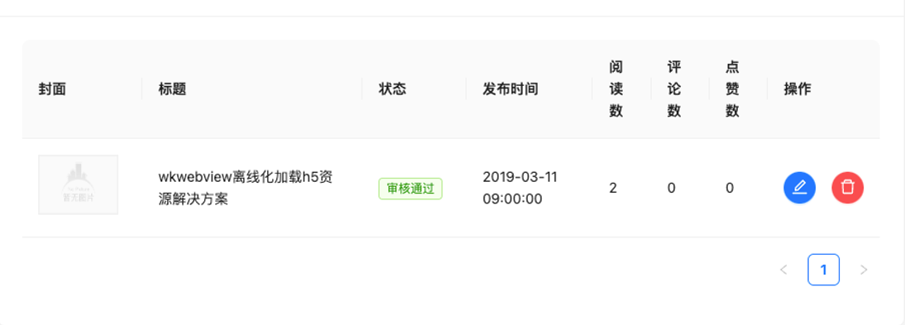
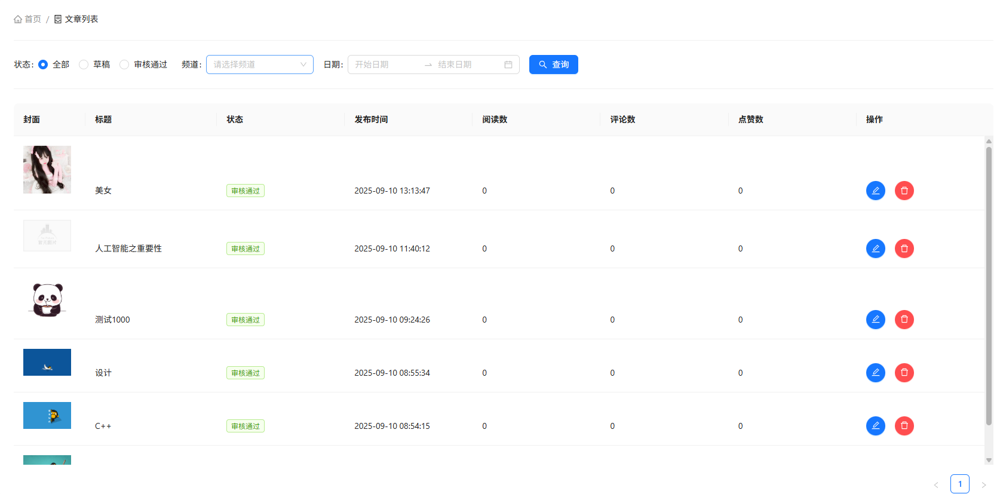

## 静态结构创建

### 筛选区结构搭建



> 1.  如何让 RangePicker 日期范围选择框选择中文
> 2.  Select 组件配合 Form.Item 使用时，如何配置默认选中项

**代码实现**

`pages/Article/index.jsx`

```jsx
import {
  Breadcrumb,
  Button,
  Form,
  Input,
  Select,
  message,
  Radio,
  Divider,
  DatePicker,
} from "antd";
import {
  HomeOutlined,
  ContainerOutlined,
  SearchOutlined,
} from "@ant-design/icons";
import { useEffect, useState } from "react";
import locale from "antd/es/date-picker/locale/zh_CN";
const Article = () => {
  const { RangePicker } = DatePicker;
  // 频道列表
  const [channels, setChannels] = useState([]);
  return (
    <div className="Article">
      {/* 面包屑导航 */}
      <Breadcrumb
        items={[
          {
            title: (
              <>
                <HomeOutlined />
                <span>首页</span>
              </>
            ),
          },
          {
            title: (
              <>
                <ContainerOutlined />
                <span>文章列表</span>
              </>
            ),
          },
        ]}
      />
      <Divider />
      {/* 搜索项 */}
      <Form initialValues={{ status: "" }} autoComplete="off" layout="inline">
        <Form.Item label="状态" name="status">
          <Radio.Group>
            <Radio value={""}> 全部 </Radio>
            <Radio value={0}> 草稿 </Radio>
            <Radio value={2}> 审核通过 </Radio>
          </Radio.Group>
        </Form.Item>
        <Form.Item label="频道" name="channel_id">
          <Select showSearch placeholder="请选择频道" optionFilterProp="label">
            {channels.map((item) => (
              <Select.Option key={item.id} value={item.id}>
                {item.name}
              </Select.Option>
            ))}
          </Select>
        </Form.Item>
        <Form.Item label="日期" name="date">
          {/* 传入locale属性 控制中文显示*/}
          <RangePicker locale={locale}></RangePicker>
        </Form.Item>
        <Form.Item>
          <Button type="primary" icon={<SearchOutlined />} htmlType="submit">
            查询
          </Button>
        </Form.Item>
      </Form>
    </div>
  );
};
export default Article;
```

### 表格区域结构


**代码实现**

```jsx
// 导入资源
import { Table, Tag, Space } from "antd";
import { EditOutlined, DeleteOutlined } from "@ant-design/icons";
import img404 from "@/assets/error.png";

const Article = () => {
  // 准备列数据
  const columns = [
    {
      title: "封面",
      dataIndex: "cover",
      width: 120,
      render: (cover) => {
        return (
          
        );
      },
    },
    {
      title: "标题",
      dataIndex: "title",
      width: 220,
    },
    {
      title: "状态",
      dataIndex: "status",
      render: (data) => <Tag color="green">审核通过</Tag>,
    },
    {
      title: "发布时间",
      dataIndex: "pubdate",
    },
    {
      title: "阅读数",
      dataIndex: "read_count",
    },
    {
      title: "评论数",
      dataIndex: "comment_count",
    },
    {
      title: "点赞数",
      dataIndex: "like_count",
    },
    {
      title: "操作",
      render: (data) => {
        return (
          <Space size="middle">
            <Button type="primary" shape="circle" icon={<EditOutlined />} />
            <Button
              type="primary"
              danger
              shape="circle"
              icon={<DeleteOutlined />}
            />
          </Space>
        );
      },
    },
  ];
  // 准备表格body数据
  const data = [
    {
      id: "8218",
      comment_count: 0,
      cover: {
        images: [],
      },
      like_count: 0,
      pubdate: "2019-03-11 09:00:00",
      read_count: 2,
      status: 2,
      title: "wkwebview离线化加载h5资源解决方案",
    },
  ];
  return (
    <div>
      ...
      <Table rowKey="id" columns={columns} dataSource={data} />
    </div>
  );
};
```

## 自定义 Hooks 渲染频道数据

**实现步骤**

1. 创建 `useChannel.js` 文件，封装获取频道列表的逻辑
2. 在列表页中引入 `useChannel.js` 文件
3. 解构`hooks`，获取频道列表数据

**代码实现**

::: code-group

```jsx [hooks/useChannel.js]
// 封装获取频道列表的逻辑
import { useState, useEffect } from "react";
import http from "@/utils/http";
export default function useChannel() {
  const [channelList, setChannelList] = useState([]);

  useEffect(() => {
    function getChannelList() {
      http.get("/channels").then((res) => {
        setChannelList(res.data.channels);
      });
    }
    getChannelList();
  }, []);

  return { channelList, setChannelList };
}
```

```jsx [pages/Article/index.jsx]
import useChannel from "@/hooks/useChannel";

const Article = () => {
  const { channelList } = useChannel();
  return (
    ...
    <Form.Item label="频道" name="channel_id">
      <Select
        showSearch
        placeholder="请选择频道"
        optionFilterProp="label"
        style={{ width: 180 }}
      >
        {channelList.map((item) => (
          <Select.Option key={item.id} value={item.id}>
            {item.name}
          </Select.Option>
        ))}
      </Select>
    </Form.Item>
  );
};
```

:::

## 渲染表格数据



**实现步骤**

1. 声明列表相关数据管理
2. 使用 useState 声明参数相关数据管理
3. 调用接口获取数据
4. 使用接口数据渲染模板

**代码实现**

```jsx
const Article = () => {
  // 省略部分代码...
  // 文章列表数据管理
  const [article, setArticleList] = useState({
    list: [],
    count: 0,
  });

  const [params, setParams] = useState({
    page: 1,
    per_page: 4,
    begin_pubdate: null,
    end_pubdate: null,
    status: null,
    channel_id: null,
  });

  useEffect(() => {
    async function fetchArticleList() {
      const res = await http.get("/mp/articles", { params });
      const { results, total_count } = res.data;
      setArticleList({
        list: results,
        count: total_count,
      });
    }
    fetchArticleList();
  }, [params]);

  // 模板渲染
  return (
    ...
    {/* 表格 */}
    <Table rowKey="id" columns={columns} dataSource={articleList.list} scroll={{ y: 550 }} />
  );
};
```

## 筛选功能实现

**实现步骤**

1. 为表单添加`onFinish`属性监听表单提交事件，获取参数
2. 根据接口字段格式要求格式化参数格式
3. 修改`params` 参数并重新使用新参数重新请求数据

**代码实现**

```jsx
// 获取文章列表
const [list, setList] = useState([]);
const [count, setCount] = useState(0);

async function getList(reqData = {}) {
  const res = await getArticleListAPI(reqData);
  setList(res.data.results);
  setCount(res.data.total_count);
}

useEffect(() => {
  getList();
}, []);

// 筛选文章列表
const onFinish = async (formValue) => {
  console.log(formValue);
  // 1. 准备参数
  const { channel_id, date, status } = formValue;
  const reqData = {
    status,
    channel_id,
    begin_pubdate: date[0].format("YYYY-MM-DD"),
    end_pubdate: date[1].format("YYYY-MM-DD"),
  };
  // 2. 使用参数获取新的列表
  getList(reqData);
};
```

## 分页功能实现

**实现步骤**

1. 为 Table 组件指定 pagination 属性来展示分页效果
2. 在分页切换事件中获取到筛选表单中选中的数据
3. 使用当前页数据修改 params 参数依赖引起接口重新调用获取最新数据

**代码实现**

```jsx
const pageChange = (page) => {
  // 拿到当前页参数 修改params 引起接口更新
  setParams({
    ...params,
    page,
  });
};

return (
  <Table
    rowKey="id"
    columns={columns}
    dataSource={article.list}
    pagination={{
      current: params.page,
      pageSize: params.per_page,
      onChange: pageChange,
      total: article.count,
    }}
  />
);
```

## 删除功能


**实现步骤**

1. 给删除文章按钮绑定点击事件
2. 弹出确认窗口，询问用户是否确定删除文章
3. 拿到参数调用删除接口，更新列表

**代码实现**

```jsx
// 删除回调
const delArticle = async (data) => {
    await http.delete(`/mp/articles/${data.id}`)
    // 更新列表
    setParams({
      page: 1,
      per_page: 10
    })
}

const columns = [
  // ...
  {
      title: '操作',
      render: data => {
        return (
          <Space size="middle">
            <Button type="primary" shape="circle" icon={<EditOutlined />} />
            <Popconfirm
              title="确认删除该条文章吗?"
              onConfirm={() => delArticle(data)}
              okText="确认"
              cancelText="取消"
            >
              <Button
                type="primary"
                danger
                shape="circle"
                icon={<DeleteOutlined />}
              />
            </Popconfirm>
          </Space>
        )
      }
]
```

## 编辑文章跳转

**代码实现**

```jsx
const columns = [
  // ...
  {
    title: "操作",
    render: (data) => (
      <Space size="middle">
        <Button
          type="primary"
          shape="circle"
          icon={<EditOutlined />}
          onClick={() => navagite(`/publish?id=${data.id}`)}
        />
        />
      </Space>
    ),
  },
];
```
