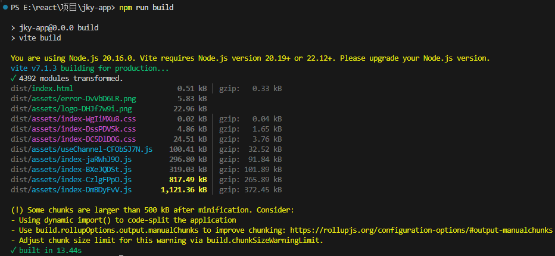
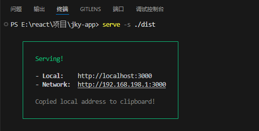

## 项目打包
```bash
npm run build
```

## 项目本地预览
**实现步骤**

1. 全局安装本地服务包 `serve`，用来启动本地服务器
```bash
npm i -g serve
```
2. 在项目`dist`目录中开启服务器
```bash
serve -s ./dist
```
3. 在浏览器中访问：`http://localhost:3000/` 预览项目



## 优化-路由懒加载
**使用步骤**

1. 使用 `lazy` 方法导入路由组件
2. 使用内置的 `Suspense` 组件渲染路由组件

**代码实现**

`router/index.js`

```jsx
import { createBrowserRouter } from 'react-router-dom'
import { lazy, Suspense } from 'react'
import Login from '@/pages/Login'
import Layout from '@/pages/Layout'

import AuthRoute from '@/components/Auth'

const Publish = lazy(() => import('@/pages/Publish'))
const Article = lazy(() => import('@/pages/Article'))
const Home = lazy(() => import('@/pages/Article'))


const router = createBrowserRouter([
  {
    path: '/',
    element: (
      <AuthRoute>
        <Layout />
      </AuthRoute>
    ),
    children: [
      {
        index: true,
        element: (
          <Suspense fallback={'加载中'}>
            <Home />
          </Suspense>
        )
      },
      {
        path: 'article',
        element: (
          <Suspense fallback={'加载中'}>
            <Article />
          </Suspense>
        )
      },
      {
        path: 'publish',
        element: (
          <Suspense fallback={'加载中'}>
            <Publish />
          </Suspense>
        )
      },
    ],
  },
  {
    path: '/login',
    element: <Login />,
  },
])

export default router
```
> [!WARNING] 注意
> 我们可以在打包之后，通过切换路由，监控network面板资源的请求情况，验证是否分隔成功

## 优化打包体积（了解）

优化打包体积是提升项目性能的重要手段。以下是针对当前项目（基于 `vite` 和 `React`）的具体优化步骤：

---

### **1. 分析打包体积**
首先，你需要明确哪些模块或文件占用了较大的体积。可以通过以下方式生成打包分析报告：
```bash
npm run build -- --mode analyze
```
或者：
```bash
yarn build --mode analyze
```
这会生成一个可视化的报告，显示每个模块的体积及其占比。

---

### **2. 具体优化步骤**

#### **(1) 按需引入第三方库**
当前项目中使用了 `antd` 和 `echarts` 等较大的库，可以通过按需引入来减少体积。

- **优化 `antd`**：
  修改引入方式，从全量引入改为按需引入：
  ```javascript
  // 错误示例：全量引入
  import { Button } from 'antd';

  // 正确示例：按需引入
  import Button from 'antd/es/button';
  import 'antd/es/button/style/css'; // 如果需要样式
  ```

- **优化 `echarts`**：
  使用 `echarts` 的按需引入功能：
  ```javascript
  import * as echarts from 'echarts/core';
  import { BarChart } from 'echarts/charts';
  import { GridComponent } from 'echarts/components';
  import { CanvasRenderer } from 'echarts/renderers';

  echarts.use([BarChart, GridComponent, CanvasRenderer]);
  ```

#### **(2) 启用代码分割（Code Splitting）**
`vite` 默认支持代码分割，但你可以进一步优化路由级别的懒加载：
```javascript
// 使用 React.lazy 和 Suspense 实现懒加载
const Home = React.lazy(() => import('./pages/Home'));
const About = React.lazy(() => import('./pages/About'));

function App() {
  return (
    <Suspense fallback={<div>Loading...</div>}>
      <Routes>
        <Route path="/" element={<Home />} />
        <Route path="/about" element={<About />} />
      </Routes>
    </Suspense>
  );
}
```

#### **(3) 压缩静态资源**
`vite` 默认会压缩资源，但你可以进一步优化：
- 使用 `vite-plugin-compression` 插件压缩文件：
  ```bash
  npm install vite-plugin-compression --save-dev
  ```
  在 `vite.config.js` 中配置：
  ```javascript
  import viteCompression from 'vite-plugin-compression';

  export default {
    plugins: [
      viteCompression({
        algorithm: 'gzip',
        ext: '.gz',
      }),
    ],
  };
  ```

#### **(4) 移除未使用的代码（Tree Shaking）**
确保你的代码和依赖项中没有未使用的模块。`vite` 默认支持 Tree Shaking，但需要注意：
- 避免直接引入整个库（如 `import * as _ from 'lodash'`）。
- 使用 ES6 的模块语法（`import/export`）。

#### **(5) 优化图片资源**
- 使用 `vite-plugin-imagemin` 压缩图片：
  ```bash
  npm install vite-plugin-imagemin --save-dev
  ```
  在 `vite.config.js` 中配置：
  ```javascript
  import viteImagemin from 'vite-plugin-imagemin';

  export default {
    plugins: [
      viteImagemin({
        gifsicle: { optimizationLevel: 3 },
        mozjpeg: { quality: 75 },
        pngquant: { quality: [0.8, 0.9] },
        svgo: {
          plugins: [
            { removeViewBox: false },
            { cleanupIDs: false },
          ],
        },
      }),
    ],
  };
  ```

#### **(6) 使用 CDN 加载第三方库**
将一些较大的第三方库（如 `react`、`react-dom`）通过 CDN 引入，减少打包体积：
- 在 `vite.config.js` 中配置：
  ```javascript
  export default {
    build: {
      rollupOptions: {
        external: ['react', 'react-dom'],
        output: {
          globals: {
            react: 'React',
            'react-dom': 'ReactDOM',
          },
        },
      },
    },
  };
  ```
- 在 `index.html` 中通过 `<script>` 标签引入 CDN：
  ```html
  <script src="https://cdn.jsdelivr.net/npm/react@18.2.0/umd/react.production.min.js"></script>
  <script src="https://cdn.jsdelivr.net/npm/react-dom@18.2.0/umd/react-dom.production.min.js"></script>
  ```

---

### **3. 验证优化效果**
完成上述优化后，重新运行打包命令：
```bash
npm run build
```
然后查看 `dist` 目录中的文件体积是否减小，或者再次生成分析报告确认优化效果。

---

### **4. 其他建议**
- **定期更新依赖**：确保所有依赖库都是最新版本，可能包含性能优化。
- **监控打包体积**：可以集成 `webpack-bundle-analyzer` 或 `rollup-plugin-visualizer` 到 CI/CD 流程中。


