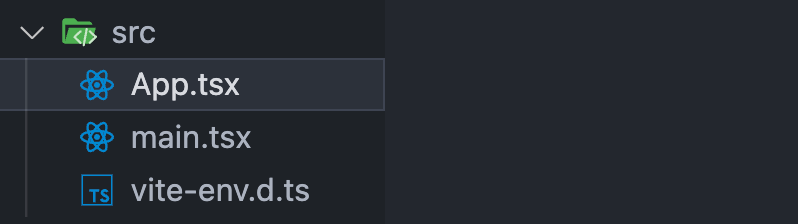

::: info 项目简介
极客园移动端是一个基于 React 技术栈开发的移动端资讯应用，为用户提供技术文章阅读服务。项目采用现代前端开发技术和最佳实践，实现了文章列表浏览、文章详情阅读等核心功能。
:::
## 初始化项目
```bash
npm create vite@latest react-jike-mobile -- --template react-ts
```
### 安装依赖包
```bash
npm i 
```
### 清理项目目录结构

## 安装 antd-mobile
```bash
npm install --save antd-mobile
```
### 测试antd组件
```bash
import { Button } from 'antd-mobile'

function App() {
  return (
    <>
      <Button>click me </Button>
    </>
  )
}

export default App
```

## 初始化路由
> `react-router`是react官方的组件库
### 安装路由
```bash
npm i react-router-dom
```

### 路由配置
::: code-group
```tsx [pages/List/index.tsx]
const List = () => {
  return <div>this is List</div>
}

export default List
```

```tsx [pages/Detail/index.tsx]
const Detail = () => {
  return <div>this is Detail</div>
}

export default Detail
```
:::

::: code-group
```tsx [router/index.tsx]
import { createBrowserRouter } from 'react-router-dom'
import List from '../pages/List'
import Detail from '../pages/Detail'

const router = createBrowserRouter([
  {
    path: '/',
    element: <List />,
  },
  {
    path: '/detail',
    element: <Detail />,
  },
])

export default router
```

```tsx [main.tsx]
import ReactDOM from 'react-dom/client'
import { RouterProvider } from 'react-router-dom'
import router from './router/index.tsx'

ReactDOM.createRoot(document.getElementById('root')!).render(
  <RouterProvider router={router} />
)
```
:::
## 配置路径别名
> 在vite.config.ts中添加路径别名
### 修改vite配置
```javascript
import { defineConfig } from 'vite'
import react from '@vitejs/plugin-react'
import path from 'path'

// https://vitejs.dev/config/
export default defineConfig({
  plugins: [react()],
  resolve: {
    alias: {
      '@': path.resolve(__dirname, './src'),
    },
  },
})

```
### 安装node类型包
```bash
npm i @types/node -D
```
## 修改tsconfig.json文件
```json
{
  "baseUrl": ".",
  "paths": {
    "@/*": [
      "src/*"
    ]
  },
}
```
## axios安装配置
> axios是一个基于 promise 的 HTTP 库，可以用于浏览器和 node.js 的异步请求。
### 安装axios
```bash
npm i axios
```
### axios封装
```typescript
import axios from 'axios'

const requestInstance = axios.create({
  baseURL: 'http://geek.itheima.net/v1_0',
  timeout: 5000,
})

requestInstance.interceptors.request.use(
  (config) => {
    return config
  },
  (error) => {
    return Promise.reject(error)
  }
)

requestInstance.interceptors.response.use(
  (response) => {
    return response
  },
  (error) => {
    return Promise.reject(error)
  }
)

export default requestInstance
```

## API模块封装


::: code-group
```typescript [apis/types.ts]
export type ResType<T> = {
  message: string
  data: T
}
```

```tsx [apis/list.ts]
import { http } from '@/utils'
import type { ResType } from './types'

type ChannelRes = {
  channels: { id: number; name: string }[]
}

export function fetchChannelAPI() {
  return http.request<ResType<ChannelRes>>({
    url: '/channels',
  })
}
```
:::

[API接口地址](https://apifox.com/apidoc/shared-fa9274ac-362e-4905-806b-6135df6aa90e/api-23348775)
