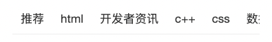

## 整体结构设计


## Tabs模块实现

### 准备静态结构
::: code-group
```tsx [pages/List/index.tsx]
import { Tabs } from 'antd-mobile'
import './index.css'

const List = () => {
  return (
    <div className="tabContainer">
       <Tabs defaultActiveKey="0">
          <Tabs.Tab title='abc' key='0'>
            <div className="listContainer">
               {/* HomeList列表 */}
            </div>
          </Tabs.Tab>
      </Tabs>
      {/*
        <Tabs>
         <Tabs.Tab title='水果' key='fruits'>
            菠萝
          </Tabs.Tab>
          <Tabs.Tab title='蔬菜' key='vegetables'>
            西红柿
          </Tabs.Tab>
          <Tabs.Tab title='动物' key='animals'>
            蚂蚁
          </Tabs.Tab>
        </Tabs>
       */
      }
    </div>
  )
}

export default List
```
```css [index.css]
.tabContainer {
  position: fixed;
  height: 50px;
  top: 0;
  width: 100%;
}

.listContainer {
  position: fixed;
  top: 50px;
  bottom: 0px;
  width: 100%;
}
```
:::
### 封装接口和类型

::: code-group
```typescript [apis/list.ts]
import { http } from '@/utils'
import type { ResType } from './type'

export type ChannelItem = {
  id: string
  name: string
}

type ChannelRes = {
  channels: ChannelItem[]
}

export function fetchChannelAPI() {
  return http.request<ResType<ChannelRes>>({
    url: '/channels',
  })
}
```

```typescript [pages/List/useTabs.ts]
import { fetchChannelAPI } from '@/apis/list'
import type { ChannelItem } from '@/apis/list'
import { useEffect, useState } from 'react'

function useFetchChannels() {
  const [channels, setChannels] = useState<ChannelItem[]>([])
  useEffect(() => {
    async function getChannels() {
      try {
        const { data } = await fetchChannelAPI()
        setChannels(data.data.channels)
      } catch (error) {
        throw new Error('fetch channels error')
      }
    }
    getChannels()
  }, [])
  return {
    channels,
  }
}

export { useFetchChannels }
```

```tsx [pages/List/index.tsx]
import { Tabs } from 'antd-mobile'
import HomeList from './HomeList'
import { useFetchChannels } from './useTabs'

import './style.css'

const List = () => {
  const { channels } = useFetchChannels()

  return (
    <Tabs defaultActiveKey="0">
      {channels.map((item) => (
        <Tabs.Tab title={item.name} key={item.id}>
          <div className="listContainer">
             {/* HomeList列表 */}
          </div>
        </Tabs.Tab>
      ))}
    </Tabs>
  )
}

export default List
```
:::
## List模块实现-渲染基础数据
### 准备基础结构

::: code-group
```tsx [List/HomeList/index.tsx]
import { Image, List } from 'antd-mobile'
// mock数据
import { users } from './users'

const HomeList = () => {
  return (
    <>
      <List>
        {users.map((item) => (
          <List.Item
            key={item.id}
            prefix={
              <Image
                src={item.avatar}
                style={{ borderRadius: 20 }}
                fit="cover"
                width={40}
                height={40}
              />
            }
            description={item.description}
            >
            {item.name}
          </List.Item>
        ))}
      </List>
    </>
  )
}

export default HomeList
```

```typescript [users.ts]
export const users = [
  {
    id: '1',
    avatar:
      'https://images.unsplash.com/photo-1548532928-b34e3be62fc6?ixlib=rb-1.2.1&q=80&fm=jpg&crop=faces&fit=crop&h=200&w=200&ixid=eyJhcHBfaWQiOjE3Nzg0fQ',
    name: 'Novalee Spicer',
    description: 'Deserunt dolor ea eaque eos',
  },
  {
    id: '2',
    avatar:
      'https://images.unsplash.com/photo-1493666438817-866a91353ca9?ixlib=rb-0.3.5&q=80&fm=jpg&crop=faces&fit=crop&h=200&w=200&s=b616b2c5b373a80ffc9636ba24f7a4a9',
    name: 'Sara Koivisto',
    description: 'Animi eius expedita, explicabo',
  },
  {
    id: '3',
    avatar:
      'https://images.unsplash.com/photo-1542624937-8d1e9f53c1b9?ixlib=rb-1.2.1&q=80&fm=jpg&crop=faces&fit=crop&h=200&w=200&ixid=eyJhcHBfaWQiOjE3Nzg0fQ',
    name: 'Marco Gregg',
    description: 'Ab animi cumque eveniet ex harum nam odio omnis',
  },
  {
    id: '4',
    avatar:
      'https://images.unsplash.com/photo-1546967191-fdfb13ed6b1e?ixlib=rb-1.2.1&q=80&fm=jpg&crop=faces&fit=crop&h=200&w=200&ixid=eyJhcHBfaWQiOjE3Nzg0fQ',
    name: 'Edith Koenig',
    description: 'Commodi earum exercitationem id numquam vitae',
  },
]
```
:::
### 封装请求API

**代码**
```typescript
// ... existing code ...
// 列表接口请求参数类型
export type ListParams = {
  channel_id: string
  timestamp: string
}

// 列表项数据类型
type ListItem = {
  art_id: string
  title: string
  aut_id: string
  comm_count: number
  pubdate: string
  aut_name: string
  is_top: 0 | 1
  cover: {
    type: 0 | 1 | 3
    images: string[]
  }
}

// 列表接口响应数据类型
export type ListRes = {
  results: ListItem[]
  pre_timestamp: string
}

/**
 * 获取文章列表数据
 * @param params - 请求参数对象
 * @param params.channel_id - 频道ID
 * @param params.timestamp - 时间戳
 * @returns 返回文章列表和前一个时间戳
 */
export function fetchListAPI(params: ListParams) {
  return http.request<ResType<ListRes>>({
    url: '/articles',
    params,
  })
}
// ... existing code ...
```
### 获取渲染基础列表数据
```tsx
import { ListRes, fetchListAPI } from '@/apis/list'
import { Image, List } from 'antd-mobile'
import { useState, useEffect } from 'react'

const HomeList = (props: Props) => {
  const { channelId } = props
  // list control
  const [listRes, setListRes] = useState<ListRes>({
    results: [],
    pre_timestamp: '' + new Date().getTime(),
  })
  // 初始数据获取
  useEffect(() => {
    async function getList() {
      try {
        const res = await fetchListAPI({
          channel_id: '0',
          timestamp: '' + new Date().getTime(),
        })
        setListRes(res.data.data)
      } catch (error) {
        throw new Error('fetch list error')
      }
    }
    getList()
  }, [])

  return (
    <>
      <List>
        {listRes.results.map((item) => (
          <List.Item
            key={item.art_id}
            prefix={
              <Image
                src={item.cover.images?.[0]}
                style={{ borderRadius: 20 }}
                fit="cover"
                width={40}
                height={40}
              />
            }
            description={item.pubdate}>
            >
            {item.title}
          </List.Item>
        ))}
      </List>
    </>
  )
}

export default HomeList
```
## List模块实现-tabs切换

### 实现步骤

1. 创建组件props
2. 子组件传入不同channelId

::: code-group
```tsx [List/HomeList/index.tsx]
import { ListRes, fetchListAPI } from '@/apis/list'
import { Image, List, InfiniteScroll } from 'antd-mobile'
import { useState, useEffect } from 'react'

type Props = {
  channelId: string
}

const HomeList = (props: Props) => {
  const { channelId } = props
  // list control
  const [listRes, setListRes] = useState<ListRes>({
    results: [],
    pre_timestamp: '' + new Date().getTime(),
  })
  // 初始数据获取
  useEffect(() => {
    async function getList() {
      try {
        const res = await fetchListAPI({
          channel_id: channelId,
          timestamp: '' + new Date().getTime(),
        })
        setListRes(res.data.data)
      } catch (error) {
        throw new Error('fetch list error')
      }
    }
    getList()
  }, [channelId])
  
  return (
    <>
      <List>
        {listRes.results.map((item) => (
          <List.Item
            key={item.art_id}
            prefix={
              <Image
                src={item.cover.images?.[0]}
                style={{ borderRadius: 20 }}
                fit="cover"
                width={40}
                height={40}
              />
            }>
            {item.title}
          </List.Item>
        ))}
      </List>
    </>
  )
}

export default HomeList
```

```tsx [List/index.tsx]
<Tabs.Tab title={item.name} key={item.id}>
  {/* list组件 */}
  <HomeList channelId={'' + item.id} />
</Tabs.Tab>
```
:::
## List模块无限加载实现
> 使用`InfiniteScroll`组件实现滚动加载
### 实现步骤

1. 创建`hasMore`状态和`loadMore`函数
2. 合并新旧数据并更新时间戳
3. 无数据时停止加载


```typescript
import { ListRes, fetchListAPI } from '@/apis/list'
import { Image, List, InfiniteScroll } from 'antd-mobile'
import { useState, useEffect } from 'react'

type Props = {
  channelId: string
}

const HomeList = (props: Props) => {
  const { channelId } = props
  // list control
  const [listRes, setListRes] = useState<ListRes>({
    results: [],
    pre_timestamp: '' + new Date().getTime(),
  })
  // 初始数据获取
  useEffect(() => {
    async function getList() {
      try {
        const res = await fetchListAPI({
          channel_id: channelId,
          timestamp: '' + new Date().getTime(),
        })
        setListRes(res.data.data)
      } catch (error) {
        throw new Error('fetch list error')
      }
    }
    getList()
  }, [channelId])

  // 加载更多
  const [hasMore, setHadMore] = useState(true)
  const loadMore = async () => {
    try {
      const res = await fetchListAPI({
        channel_id: channelId,
        timestamp: listRes.pre_timestamp,
      })
      // 没有数据立刻停止
      if (res.data.data.results.length === 0) {
        setHadMore(false)
      }
      setListRes({
        // 拼接新老列表数据
        results: [...listRes.results, ...res.data.data.results],
        // 重置时间参数 为下一次请求做准备
        pre_timestamp: res.data.data.pre_timestamp,
      })
    } catch (error) {
      throw new Error('load list error')
    }
  }
  
  return (
    <>
      <List>
        {listRes.results.map((item) => (
          <List.Item
            key={item.art_id}
            prefix={
              <Image
                src={item.cover.images?.[0]}
                style={{ borderRadius: 20 }}
                fit="cover"
                width={40}
                height={40}
              />
            }>
            {item.title}
          </List.Item>
        ))}
      </List>
      <InfiniteScroll loadMore={loadMore} hasMore={hasMore} />
    </>
  )
}

export default HomeList
```
